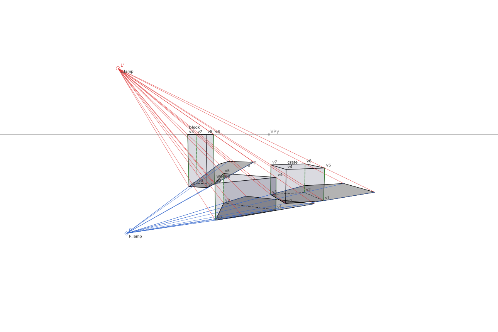

# 透視陰影作圖系統（cast-space-to-plane / `castplane`）

在 3D 裡擺好物件、光源與受影面，任選相機位置、角度與焦距，系統輸出**數學正確**的透視線稿、投射陰影，以及畫家能照著畫的**作圖線**：光源點 L′、陰影消失點 F′、每個頂點的 L′P′ 與 F′Q′ 輔助線。作圖線是必要輸出，不是附加功能——引擎能算影子不稀奇，缺的是讓人看懂「影子為什麼落在那裡」的作圖法。

用途：畫漫畫與插畫背景時的透視與陰影底稿。輸出的 SVG 分圖層，可直接疊進繪圖軟體描繪；JSON 記錄畫面上每個點的 3D 來源；PNG 供不吃 SVG 的軟體使用。

v1 範圍（規格 §1）：五種參數化基元（方塊、圓柱、球、圓錐、任意多邊形稜柱）、單一光源（點光或平行光）、單一受影面（無界地面 z = 0）、直線透視相機（含俯仰的三點透視、焦距、主點偏移）、投射陰影與受光／背光判定、SVG / JSON / PNG 輸出，純 Python 函式庫加命令列。多受影面、隱藏線消除、網格匯入、多光源、曲線透視、軟陰影、互動 UI 列入後續版本。

- 規格文件：[`docs/spec/spec-v0.1.md`](docs/spec/spec-v0.1.md)
- 實作合約（規範性，英文）：[`docs/ARCHITECTURE.md`](docs/ARCHITECTURE.md)
- 命令列與 API 參考：[`docs/USAGE.md`](docs/USAGE.md)
- 決策紀錄：[`docs/DECISIONS.md`](docs/DECISIONS.md)
- 一致性測試集：[`tests/conformance/README.md`](tests/conformance/README.md)
- 效能基準：[`benchmarks/README.md`](benchmarks/README.md)

## 安裝

需要 Python ≥ 3.10；核心只依賴 numpy。

```sh
git clone https://github.com/CyberSaga/cast-space-to-plane
cd cast-space-to-plane
pip install -e .            # 函式庫與 castplane 命令列（SVG + JSON 輸出）
pip install -e '.[png]'     # 另加 cairosvg，可輸出 PNG（或在 PATH 上放 resvg 也可以）
pip install -e '.[mesh]'    # 另加 trimesh，可匯入 STL / PLY 網格（OBJ、glTF / GLB 不需要）
pip install -e '.[dev]'     # 開發：pytest、hypothesis、pillow、cairosvg
```

## 快速開始

### 命令列

```sh
castplane validate examples/basic.json              # 檢查場景檔；錯誤會指出欄位路徑
castplane info examples/basic.json                  # 地平線、消失點、L′、F′ 與警告表
castplane render examples/basic.json -o out         # out/basic.svg 與 out/basic.json
castplane render examples/basic.json -o out --formats svg,json,png --layers objects,cast_shadow,construction
castplane render examples/basic.json -o out --camera my_camera.json   # 只換相機（相機 JSON 或另一個場景檔）
castplane stages examples/basic.json -o stages.json # A 段 / B 段中間結果（除錯與移植用）
castplane render examples/wall_and_ground.json -o out --hidden-lines   # M4：地面 + 有界牆面（轉折影），隱藏線畫成虛線
castplane render examples/mesh_demo.json -o out     # 場景裡的 mesh 物件以 path 引用 OBJ 檔（M5）
castplane import tests/fixtures/meshes/box_split.obj -o box.json   # 網格檔 → 場景檔（OBJ、glTF / GLB、STL、PLY）
castplane render examples/two_lights.json -o out    # M6：兩盞點光源，每個光源一個子群組，本影疊在最上面
```

`render` 預設只寫 SVG 與 JSON；PNG 要明確以 `--formats` 要求，沒有 cairosvg / resvg 時以結束碼 3 回報，而且**什麼檔案都不寫**（同一次要求的 SVG / JSON 也不寫，避免半成品；先不加 `png` 再跑一次即可）。結束碼：0 成功、1 檔案錯誤、2 輸入無效（訊息含欄位路徑，例如 `error: objects[1].radius: must be > 0`）、3 缺少選用相依套件。完整選項見 [`docs/USAGE.md`](docs/USAGE.md)。

### Python API

計算分三段（規格 §3）：A 段只看物件、光源與受影面，B 段才用到相機，C 段整理成文件。換相機只需重跑 B、C。

```python
import castplane
from castplane.output.svg import write_svg
from castplane.output.geometry_json import dumps

scene = castplane.load_scene("examples/basic.json")   # 驗證並補上預設值；錯誤拋 SceneError(field=...)
A = castplane.shadow_geometry(scene)                   # A 段：世界座標的影子、光輪廓、垂足（與相機無關）
B = castplane.project_scene(scene, A)                  # B 段：相機投影、近平面裁切、作圖線與自我驗證
doc = castplane.compose(scene, B)                      # C 段：規格 §6.2 的幾何文件（純 JSON 資料）
svg = write_svg(doc, layers=["objects", "cast_shadow", "construction"])
open("out.svg", "w", encoding="utf-8").write(svg)
open("out.json", "w", encoding="utf-8").write(dumps(doc))

# 只換相機：A 段快取，重算 B、C
camera = {"position": [0, 0, 3], "target": [0, 5, 0], "focal_length_mm": 50, "frame_mm": [36, 24]}
doc2 = castplane.compose(scene, castplane.project_scene(scene, A, camera=camera))

# 一次做完：render() = A + B + C + SVG
result = castplane.render(scene)        # {"geometry": doc, "svg": "<svg …>"}

# M4：取樣式消隱（預設關閉；None = 用場景的 output.hidden_lines / hidden_style）
result = castplane.render(scene, hidden_lines=True, hidden_style="dashed")   # 或 "omit"

# M6：兩個以上光源時文件多了 constructions / umbra / form_shadow_core；拖曳相機時可略過本影
B = castplane.project_scene(scene, A, camera=camera, umbra=False)   # umbra[].polygons = None（不計算）
```

### 網頁 UI / TypeScript

核心另有一份 TypeScript 移植（`ts/`，零執行期相依，函式名稱與 Python 相同），以同一個一致性測試集驗收（34/34）。SVG 輸出與 Python 逐位元組相同。只換相機的重算在 node 上約 55–63 ms，達到規格 §8 的 < 100 ms。`web/` 是建在移植上的 three.js 網頁 UI，功能包括：

- 開啟或拖放場景 JSON，也可以從範例選單載入；
- 以 3D 顯示物件、光源與地面，用滑鼠拖曳相機，用滑桿調整焦距與滾轉；
- 作圖線稿每個影格由移植的核心重新寫出 SVG，疊在 3D 畫面上；
- 可下載 SVG、JSON，以及帶目前相機的場景檔（Python 命令列可重現同一張圖）。

它是純靜態網頁，不需要伺服器。

```sh
npm ci && npm run build          # ts → web
npm run -w web preview           # 本機開啟 web/dist
npm test                         # TypeScript 與網頁的測試
```

說明見 [`docs/USAGE.md`](docs/USAGE.md) §4、[`ts/README.md`](ts/README.md) 與 [`web/README.md`](web/README.md)。截圖：[`docs/images/web_ui.png`](docs/images/web_ui.png)。

## 作圖線是什麼



上圖由 `castplane render examples/construction_demo.json -o out --formats png --dpi 120` 產生（為了閱讀把透明背景改成白色）。畫家在紙上重建影子只需要兩個點和兩條線（規格 §2、§5.5）：

| 記號 | 意義 | 圖中位置 |
| --- | --- | --- |
| **L′（光源點）** | 光源 L 在畫面上的投影。點光源時是有限點；光源在觀者後方時仍是有限點，但落在地平線下方，稱**反光點**；平行光時 L′ 是一個消失點，可能在畫面外甚至無窮遠（此時作圖線互相平行）。 | 左上角紅色圓圈 `L′`，標籤 `L.lamp` |
| **F′（陰影消失點）** | 光源垂足 F（光源沿地面法線投到地面的點）在畫面上的投影。平行光時 F′ 落在地平線上。 | 左下角藍色菱形 `F′`，標籤 `F.lamp` |
| **P′、Q′** | 物件頂點 P 與其垂足 Q（P 正下方的地面點）的投影。 | 頂點標籤 `v0`…`v7` |
| **L′P′（紅線）** | 光線：從光源點經過頂點。影子點一定在這條線上。 | 紅色細線 |
| **F′Q′（藍線）** | 影線：從陰影消失點經過垂足。影子點也一定在這條線上。 | 藍色細線 |
| **S′** | 兩線交點就是頂點影子 S 的投影。系統同時直接算 S = M·P 再投影，兩者必須在 1e-6 mm 內相同——這是每次輸出都做的自我驗證（`construction.checks`）。 | 影子多邊形的角 |
| **P′Q′（綠線）** | 頂點垂線，連接頂點與其垂足，是畫家找 Q′ 的工具。 | 綠色細線 |

只有**光輪廓邊**（相鄰兩面一受光、一背光）的頂點需要作圖線，它們的影子連起來就是影子輪廓。曲面基元的作圖點是切線母線端點（圓柱 `g0/g1.base/top`、圓錐 `g0/g1.base` 與 `apex`）與球的輪廓圓四個象限點（`sil.0..3`）及球心 `c`；影子邊界以圓錐曲線精確輸出。

退化情況（光源在觀者後方、光源方向與畫面平行、頂點高於點光源、頂點在相機後方……）不會中斷輸出，而是回報結構化警告（代碼 + 相關 id），見規格 §5.7 與 [`docs/ARCHITECTURE.md`](docs/ARCHITECTURE.md) §2.9。

## 輸出格式（規格 §6）

三種輸出用同一套畫面座標：單位 mm、原點在畫幅中心、u 向右、v 向上（主點在 `shift_mm` 處）；寫 SVG 時翻轉 v 並平移到左上角，`viewBox` 等於 `canvas_mm`。

### SVG 圖層（由下而上）

| `<g id>` | 內容 | 預設樣式 |
| --- | --- | --- |
| `horizon` | 地平線、x/y/z 消失點（VPx、VPy、VPz）、主點 PP | 細灰線、小圓點與名稱 |
| `objects` | 物件所有邊；曲面基元為相機輪廓母線與端面圓錐曲線。背面邊虛線（子群組 `objects.<id>.front` / `.back`） | 實線 0.3 mm；背面虛線 0.2 mm |
| `form_shadow` | 背光面（陰）填色；曲面為明暗交界線（`form_shadow.<id>.terminator`） | 半透明藍灰填色、細線 |
| `cast_shadow` | 影子多邊形，每個光源一個子群組 `cast_shadow.<light>`；曲面另附精確圓錐曲線輪廓 | 半透明黑填色加輪廓，`fill-rule="nonzero"` |
| `construction` | L′、F′ 標記，作圖線 L′P′（紅 `#d33`）、F′Q′（藍 `#36c`）、頂點垂線 P′Q′（綠 `#3a3`） | 0.15 mm |
| `labels` | 頂點編號、作圖點名稱、`L.<light>` / `F.<light>`、物件 id | 2.2 mm 小字 |

`output.layers` 或 `--layers` 選擇子集，順序固定。v1 不消隱，所有邊都畫。

**M6 多光源（合約 §5.3.6）。** `lights` 有兩個以上光源時，`form_shadow`、`cast_shadow`、`construction` 三層改成**每個光源一個子群組**（`form_shadow.<light>`、`cast_shadow.<light>`、`construction.<light>`，依光源 id 的碼位順序）：各光源的影子填色降為 `fill-opacity = 0.3 / N_act`、背光面 `0.18 / N_act`（`N_act` 是在某個受影面上有效的光源數；兩盞時 `0.15` / `0.09`），只被部分光源遮住的區域（半影）因此較淡；**本影**（被所有有效光源都遮住的區域）以一個 `<path>` 畫在 `cast_shadow.umbra`（`fill-opacity="0.3"`、不描邊，每塊凸片一個 `M … Z` 子路徑），被所有光源背光的面畫一次在 `form_shadow.core`（原本的 0.18 色調）。半影不另外存成多邊形：就是各光源子群組露出本影之外的部分。只有一個光源時 SVG 與單光源版本逐位元相同。

**M4 隱藏線（合約 §5.1.8）。** `output.hidden_lines`（或 `--hidden-lines`、`render(..., hidden_lines=True)`）開啟時，每條邊、母線、明暗交界線、圓錐曲線與影子輪廓邊依取樣結果切成可見段與隱藏段：可見段留在原本的群組，隱藏段放進各層**第一個**子群組 `objects.hidden` / `form_shadow.hidden` / `cast_shadow.hidden`，畫成 0.15 mm 虛線（`hidden_style: "dashed"`，預設）或留空（`"omit"`，真正的消隱）；影子的填色不受影響，輪廓改畫在 `cast_shadow.<light>.<object>.outline`。關閉時 SVG 與 v2 位元相同。有界受影面的邊畫在 `objects.<受影面 id>`，板子的影子跟物件的影子一樣在 `cast_shadow.<light>`。

### JSON 幾何（規格 §6.2）

每個 2D 點都記錄來源 3D 點：`points[name] = {world, image, depth}`（`image` 為 `[u, v]`，在相機後方時為 `null`）；方向點（平行光的 L、F）為 `{direction, at_infinity: true, image}`。點名規則：

| 名稱 | 意義 |
| --- | --- |
| `<物件>.v<k>` | 網格頂點 k（方塊 v0–v3 底面、v4–v7 頂面；稜柱 v0..n−1 底面、vn..2n−1 頂面） |
| `<物件>.v<k>.shadow.<光源>` | 該頂點在受影面上的影子 S（只有光輪廓頂點、且影子有限時） |
| `<物件>.v<k>.foot` | 該頂點的垂足 Q |
| `L.<光源>`、`F.<光源>` | 光源與其垂足 |
| `<物件>.s<k>.<光源>` | 地面交點：物件被地面切開時插入的點，以及曲面影子多邊形的取樣點（本身就是自己的影子與垂足，無作圖線） |
| `<物件>.c`、`<物件>.sil.<k>`、`<物件>.g<k>.base/.top`、`<物件>.apex` | 曲面基元的作圖點（球心、輪廓圓象限點、切線母線端點、圓錐頂點），同樣可加 `.shadow.<光源>` / `.foot` |
| `<物件>.og<k>.base/.top` | 相機輪廓母線端點（隨相機改變，不在 `edges[]` 中，無作圖線） |
| `<受影面>.b<k>` | M4：有界受影面的 bounds 頂點 k（板子當施影體時同樣有 `.shadow.<光源>[.<受影面>]` / `.foot[.<受影面>]`） |
| `….shadow.<光源>.<受影面>`、`….foot.<受影面>`、`<物件>.s<k>.<光源>.<受影面>`、`F.<光源>.<受影面>` | M4：`receivers[0]` 以外的受影面在名稱末尾加 `.<受影面 id>`（`receivers[0]` 保留上面的短名稱） |

其他區塊：`edges[]`（`from`、`to`、`silhouette`、`back`、`segment` 畫面線段）、`shadows[]`（`outline` / `loops` 點名或 `{"direction": …}` 方向頂點、`polygons` 裁切後的可畫多邊形、`conics` 圓錐曲線、`unbounded`）、`form_shadow[]`、`outlines[]`（曲面物件的相機輪廓）、`construction`（`light_point`、`shadow_vp`、`rays`、`segments`、`checks`）、`horizon`（`v_mm`、`line`、`vanishing_points`）、`warnings[]`（`{code, ids, message}`）。M4 另有頂層 `hidden_lines`（實際生效的開關）、`receivers[]`（`plane`、`bounds`、各光源的 `lit` / `casts`）、`construction.per_receiver`、每個 `shadows[]` 的 `receiver` 與 `polygon_edges`，以及每個可消隱圖形的 `visibility`（`visible` / `hidden` / `partial`）與 `runs`（直線 `{s, t, mm, visible}`、圓錐曲線 `{interval, theta, mm, visible}` 與 `hidden_polylines`）；開關關閉時這些鍵都是「全部可見」的值。M6：兩個以上光源的文件另有 `constructions`（`{<光源>: 作圖區塊}`，每個光源一塊，含 `per_receiver`；`construction` 是第一個光源那一塊的別名）、`umbra[]`（每個受影面一筆 `{receiver, lights, polygons}`：`lights` 是在該面上有效的光源、`polygons` 是本影的凸片，畫面 mm；有效光源少於兩盞時為 `[]`，`project_scene(..., umbra=False)` 時為 `null`）、`form_shadow_core[]`（被所有光源背光的面）、`form_shadow[].light` 與 `edges[].silhouette_lights`（該邊是哪些光源的光輪廓邊；`silhouette` 是各光源的 OR）；曲面物件隨光源而異的作圖點名稱帶光源 id（`ball.sil.0.lamp`、`pillar.g0.base.sun`）。單光源文件沒有這些鍵。`castplane.umbra.umbra_from_document(doc)` 只憑文件就能逐位元重算 `umbra`。浮點數以最短往返表示寫出、鍵排序，相同輸入產生位元相同的檔案。完整鍵表在 [`docs/ARCHITECTURE.md`](docs/ARCHITECTURE.md) §3.1。

### PNG

由 SVG 柵格化（cairosvg，或 PATH 上的 resvg），解析度 `png_dpi`（或 `--dpi`），像素尺寸 `round(canvas_mm · dpi / 25.4)`，背景透明。

## 場景 JSON 參考（規格 §4）

座標系右手系、Z 向上、單位公尺、地面 z = 0；物件錨點在**底面中心**，放在地面上時 `position[2] = 0`。完整範例見 [`examples/basic.json`](examples/basic.json)，各範例說明見 [`examples/README.md`](examples/README.md)。未知鍵會被忽略。

| 區塊 | 欄位 | 規則與預設 |
| --- | --- | --- |
| 頂層 | `version` | 必填，必須是 `"0.1"` |
| | `units`、`up` | 預設 `"m"`、`"z"`，目前只接受這兩個值 |
| `objects[]` | `id` | 必填、唯一、非空、不含 `.` |
| | `type` | `box`（`size` 三個正數）、`cylinder` / `cone`（`radius`、`height` 正數）、`sphere`（`radius`）、`prism`（`polygon` 至少 3 個 `[x, y]`、不共線、不自交；順時針輸入會自動反向；`height`） |
| | `transform` | 選填；`position` 預設 `[0, 0, 0]`，`rotation_deg` 預設 `[0, 0, 0]`（Z-Y-X 順序的歐拉角，`R = Rz·Ry·Rx`）；`scale` 不允許（用 size 參數） |
| | `type: "mesh"`（M5） | `path`（網格檔，相對於場景檔目錄；CLI 與 `castplane.io.load_expanded_scene` 先展開）或內嵌 `data`（`vertices`、`faces`、選用 `smooth_groups`），選用 `node`、`up`（`"z"` / `"y"`）、`scale`、`weld_tolerance`（預設 1e-6 m）、`smooth_angle_deg`（預設 30）；面數、頂點數各 ≤ 50 000。完整規則見 [`docs/USAGE.md`](docs/USAGE.md)「場景 JSON 的 `mesh` 物件」 |
| `lights[]` | | **M6 起**：非空串列（v1 恰好一個）；`id` 唯一、非空、不含 `.`、不得與受影面 id 相同；兩個以上光源時光源 id 不得是 `umbra` / `core`、物件 id 不得是 `core`（SVG 子群組名稱；單光源場景仍可用）。光源順序就是文件裡各光源紀錄與 `umbra[].lights` 的順序 |
| | `type` | `point`（`position`）或 `directional`（`direction` 指向光源，長度必須為 1，容差 1e-9） |
| `receivers[]` | | v1 恰好一個；`type: "plane"`、`normal` 必須是 `[0, 0, 1]`、`offset` 必須是 0（預設 0）。**M4 起**：非空串列；`id` 唯一、不含 `.`、不得與物件／光源 id 相同、不得是 `hidden`；`normal` 任意單位向量（法線指向的一側是受光面，不會自動翻轉）、`offset` 任意 |
| | `bounds` | M4：選填，≥ 3 個世界座標點組成的**嚴格凸**簡單多邊形，必須在平面上（順時針輸入自動反向）；省略表示無界，只允許 `receivers[0]` 且必須是地面 z = 0；有地面時 bounds 不得低於地面。凹的受影面請拆成幾個凸板 |
| `camera` | 姿態 | `position` + `target`（≠ position）**或** `position` + `yaw_deg` + `pitch_deg`，二擇一；`roll_deg` 預設 0 |
| | 鏡頭 | `focal_length_mm` > 0；`frame_mm` 兩個正數；`shift_mm` 主點偏移，預設 `[0, 0]`；`near_m` > 0，預設 0.05 |
| `output` | `canvas_mm` | 兩個正數，長寬比必須等於 `frame_mm` 的長寬比（容差 1e-9）。**注意**：規格 §4 自己的範例（257×182 配 36×24）違反這條、會被拒絕（錯誤訊息列出兩個比值與可用的替代值），見下方「差異」第 1 點 |
| | `layers` | 六個圖層 id 的**非空**子集，省略時為全部（空串列會被拒絕，與 `--layers` 一致）；輸出順序固定 |
| | `png_dpi` | 正數，預設 300 |
| | `hidden_lines`、`hidden_style` | M4：布林，預設 `false`；`"dashed"`（預設）或 `"omit"`（見上方「M4 隱藏線」） |

違反任一規則時 `load_scene` 拋出 `SceneError`，`field` 屬性是 JSON 路徑（例如 `camera.target`、`objects[2].polygon`、`output.canvas_mm`），命令列以結束碼 2 回報。幾何退化（光源在地面下、頂點高於點光源……）**不是**錯誤，只產生警告。

## 數學模型摘要（規格 §5）

全程用齊次座標 X = (x, y, z, w)，w = 0 為無窮遠點；點光與平行光、有限點與消失點共用同一套 4×4 公式。

| 步驟 | 公式 |
| --- | --- |
| 受影面與光源 | π = (n, d)，n·x + d = 0；點光 L = (l, 1)，平行光 L = (l, 0)（l 指向光源，單位長） |
| 受光判定 | lit(f) ⇔ n_f · (l − w·p) > 0，p 為面上一點；兩種光源同式 |
| 光輪廓邊 | 相鄰兩面 lit 值不同的邊；只有其頂點需要投影 |
| 平面投影矩陣 | M = (πᵀL)·I₄ − L·πᵀ，影子點 S = M·P；S 的 w ≤ 0 表示頂點不低於點光源（影子無界） |
| 垂足 | Q = (n·n)·P − (n·p + w_P·d)·(n, 0)，光源垂足 F 同式（平行光時 F 自動成為無窮遠點） |
| 相機投影 | x̃ = K·[R \| t]·X，K = [[f, 0, u₀], [0, f, v₀], [0, 0, 1]]，(u, v) = (x̃₁/x̃₃, x̃₂/x̃₃)；先在齊次空間裁切近平面（x̃₃ ≥ near），最後才除以 w |
| 作圖線與自我驗證 | S′ ∼ (L′ × P′) × (F′ × Q′) ∼ K[R \| t]·M·P；地平線為受影面無窮遠線的投影，消失點為 (d, 0) 的投影 |
| 曲面基元 | 圓以 3×3 矩陣 C 表示，E 為圓平面到世界齊次座標的 4×3 嵌入；H = K[R \| t]·M·E，影子圓錐曲線 C′ = H⁻ᵀ·C·H⁻¹（實作用伴隨矩陣，奇異時不會拋例外）。球的光輪廓圓心 c + (r²/\|l − c\|²)(l − c)、半徑 r·√(1 − r²/\|l − c\|²)；圓柱與圓錐的光輪廓為兩條切線母線加端面圓弧 |
| 數值 | float64；容差 ε = 1e-9 × 場景尺度；齊次向量以最大分量正規化；所有判定用內積符號加容差 |

## 測試策略（規格 §7）

四層測試，從數學不變量到獨立對照組，最後固定成一致性測試集：

| 層 | 內容 | 執行 |
| --- | --- | --- |
| 單元與不變量（§7.1） | 作圖法 = 直接計算（1e-6 mm）、影子與相機無關（1e-9 m）、點光趨近平行光（max(1e-4 m, 2·δ)，δ 為 D20 推導的位似差距，並須在 10⁷ m 時縮十倍）、剛體等變（1e-6 mm）、齊次尺度不變（1e-9）、無 NaN / Inf | `python3 -m pytest -q`（全套約 1610 個測試，2–3 分鐘；`test_raycast.py` 與 `test_property.py` 最慢） |
| 解析案例（§7.2） | 單位方塊 h/(h−1)、太陽 45° / 30° 影長、球影橢圓閉式解、平視與俯仰相機 | `python3 -m pytest tests/test_analytic.py tests/test_curved.py -q` |
| 退化情況（§5.7） | 每列至少一個測試，檢查警告代碼與輸出有限 | `python3 -m pytest tests/test_degenerate.py -q` |
| 光線投射對照組（§7.3） | 亂數場景（1–10 個基元，含凹稜柱與光源垂足在凹口內的案例），地面取樣網格逐點射線測試，影子多邊形柵格化後 IoU ≥ 0.99（另逐物件比對）；與幾何法零程式碼共用 | `python3 -m pytest tests/test_raycast.py -q`（較慢） |
| 屬性測試（§7.4） | hypothesis 生成隨機場景與相機，驗證全部不變量，並針對退化情況生成專門分佈 | `python3 -m pytest tests/test_property.py -q`（較慢） |
| 一致性測試集（§7.5） | 50 個案例（v2 的 34 個 + M4 的 9 個 + M5 的 3 個內嵌網格案例 + M6 的 4 個多光源案例）的輸入與 §6.2 輸出，畫面座標容差 1e-6 mm、警告代碼集合相同；TypeScript 移植的合約。比對常數的單一來源是 `tests/conformance/rules.json`（Python 與 TypeScript 執行器共用，含逐案例的 `case_overrides`） | `python3 -m pytest tests/test_conformance.py -q`；重新產生：`python3 tools/regen_conformance.py --reason "…"`；比對規則變更：`python3 tools/regen_conformance.py --rules-only --reason "…"` |
| 消隱參考（M4） | `tests/reference/zbuffer.py` 逐像素光線投射深度緩衝（0.1 mm/px，三值判定加輪廓防護），與 castplane 零程式碼共用；29 個場景的每段 run 每 0.5 mm 取樣與其比對（≥ 99%，方塊／稜柱邊 100%），run 邊界與逐點光線投射在 ±0.15 mm 內一致 | `python3 -m pytest tests/test_hidden.py tests/test_receivers.py -q` |
| 網格（M5） | 前處理表（焊接、退化面、方向、共面合併、邊分類）、匯入方塊 = 參數化方塊（逐位元）、非流形逐面退路、載入器（OBJ、glTF `.gltf` + `.bin` / data URI、GLB、跨距存取器、鏡像節點、精確 Y-up → Z-up、STL / PLY）、`castplane import` | `python3 -m pytest tests/test_meshprep.py tests/test_mesh_pipeline.py tests/test_loaders.py -q`；夾具：`python3 tools/make_mesh_fixtures.py` |
| 多光源（M6） | 手算驗收案例（兩盞對稱點光源下的單位方塊：本影 3 片、地面面積 7/6）、每個光源的紀錄與其單光源文件逐位元相同、本影掃描線核心（`record_pieces` 表、隨機輸入對柵格 AND）、三盞光的本影對柵格 AND（IoU ≥ 0.995）與光源順序不變、對光線投射「被所有光源遮住」的遮罩 IoU ≥ 0.99、`umbra_from_document` 逐位元重算 | `python3 -m pytest tests/test_umbra.py tests/test_multilight.py -q` |
| 效能基準（§8） | 100 個基元、約 1 萬條邊：完整渲染 < 1 s、只換相機 < 100 ms；預設讀取提交的場景檔 `benchmarks/scenes/benchmark_100.json`（`benchmarks/export_scene.py` 產生，TypeScript 基準讀同一個檔） | `python3 benchmarks/bench.py`（不在預設測試內；目前量測狀態見 `benchmarks/README.md`） |

## 里程碑（規格 §10）

| 里程碑 | 交付物 | 狀態 |
| --- | --- | --- |
| M0 骨架與相機 | 場景 JSON 讀取與驗證、相機矩陣、近平面裁切、方塊線框 SVG、地平線與消失點 | 完成 |
| M1 多面體投射陰影與作圖線 | 平面投影矩陣、受光判定、光輪廓邊、影子多邊形、L′ F′ 與作圖線、六個 SVG 圖層、JSON 輸出 | 完成 |
| M2 曲面基元與形體陰影 | 圓柱、球、圓錐的圓錐曲線影子、明暗交界線、SVG ellipse 輸出 | 完成 |
| M3 核心穩定（閘門） | 光線投射對照組、屬性測試、一致性測試集 v1、效能基準 | **通過（D17 豁免）**：光線投射對照（IoU ≥ 0.99）、屬性測試、一致性測試集（目前 v5）與效能基準皆已交付並通過；§8 的「完整渲染 < 1 s」已達標（約 0.35–0.45 s），「只換相機 < 100 ms」**尚未達標**（約 110–130 ms，關閉循環 GC 約 90 ms；量測結果見 `benchmarks/README.md`）。規格 §8 將數字定為目標值，閘門審查依合約 §4 / D17 豁免這一項：CI 以 `python3 benchmarks/bench.py --gate full` 為閘門（`.github/workflows/ci.yml`），只換相機列為已知未達標、留待 M7 互動介面時收斂 |
| M4 多受影面與隱藏線 | 有界受影面、逐面裁切、轉折影、取樣式隱藏線、visibility 欄位 | 完成（已合併到主分支，一致性測試集 v4）：任意平面的有界凸受影面、bounds 裁切與錨點規則、轉折影、`RECEIVER_UNLIT`、逐受影面作圖線、取樣式消隱（`hidden_lines` 預設關閉，`--hidden-lines`）、9 個一致性案例；34 個既有案例在合併時做了一次鍵新增重產（一致性 v4，合約 §5.0.8） |
| M5 網格匯入 | OBJ、glTF/GLB 載入、前處理管線 | 完成（已合併到主分支，一致性測試集 v5）：`mesh` 物件（`path` / 內嵌 `data`）、`castplane.meshprep` 前處理（焊接 → 退化面 → 流形與方向 → 共面合併 → 平滑／特徵邊）、非流形逐面退路、`castplane.io` 載入器（OBJ、glTF / GLB、STL / PLY 經選用的 trimesh）與 `castplane import`；3 個網格一致性案例；`benchmarks/bench.py --scene mesh10k` |
| M6 多光源 | 多光源影子分組、疊影規則、SVG 子圖層 | 完成（已合併到主分支，一致性測試集 v6）：任意數量的光源、每個光源單獨以 v1 / M4 公式計算（與單光源文件逐位元相同）、本影（`castplane.umbra` 純 numpy 掃描線核心，只讀畫出的影子多邊形）、半影由各光源子群組的較淡填色呈現、`form_shadow_core`、`constructions`、曲面作圖點帶光源 id、SVG 每光源子群組與 `cast_shadow.umbra` / `form_shadow.core`、`castplane info` 列出每個光源；4 個多光源一致性案例；`benchmarks/bench.py --lights 2\|3`、`--no-umbra`；單光源文件與 SVG 完全不變 |
| M7 TypeScript 移植與網頁 UI | 核心移植、three.js 場景顯示、相機拖曳 | 第一階段完成（合約 §5.4 第 1–10 步）：TypeScript 核心（一致性測試集 v3 34/34，SVG 與 Python 逐位元組相同）、TypeScript 基準（只換相機 55–63 ms，CI `--gate both`）、three.js 網頁 UI（`web/`）、CI 的 `ts` / `web` job。第二階段（M4–M6 格式的移植、v6）待 M4–M6 合併後進行（`docs/PLAN-v2.md`） |
| M8 STEP 評估 | 可行性報告、原型解析器 | 未排程／預留 |

## 與規格文件的差異

實作過程中規格有幾處互相矛盾或留白，決定如下（完整理由見 [`docs/DECISIONS.md`](docs/DECISIONS.md) 的 D1–D20；其中**覆寫規格字面**的條目在 `docs/ARCHITECTURE.md` 標記 **[decision]**，其餘是規格留白時定下的慣例，合約正文記載）：

1. **畫布 257×182 改為 273×182。** 規格 §4 範例的 `canvas_mm = [257, 182]` 與 `frame_mm = [36, 24]` 長寬比不符（1.412 ≠ 1.5），違反規格自己的規則，因此驗證會拒絕它；`examples/basic.json` 改用 273×182（3:2，高度不變）。要用 JIS B5 紙請改片幅（例如 `[36, 25.5]`）或把畫布改成 3:2。
2. **畫面座標原點在畫幅中心，主點在 `shift_mm` 處。** 規格 §2 說「原點在主點」，§5.4 的 K 矩陣卻把主點放在 (u₀, v₀)；兩者只在無移軸時一致。採 K 公式：原點在畫幅中心，主點標記畫在 (u₀, v₀) = shift_mm × 放大倍率；所有 `image` 座標與容差都是畫布 mm（畫幅依 `canvas_mm / frame_mm` 放大）。
3. **有向射影幾何與 §7.1 第 5 列的測試範圍。** 所有齊次向量都有方向（有限點 w = +1、方向向量指向射線前進方向、平行光指向光源、受影面以光源為正側），符號判定依此；因此「齊次尺度不變」只以正純量測試輸入，正負純量測試與符號無關的輸出，而且因為場景文件只含標準形輸入，這條不變量在輔助函式層級驗證，無法透過 `render` 端到端驗證。
4. **光源在觀者後方時作圖線畫成 2D 線段。** 規格 §5.7 第 1 列說「作圖線經近平面裁切後繪製」，但 3D 線段 LP 的影像是 2D 線段 L′P′ 的補集，而 S′ 可證明落在 L′ 與 P′ 之間；畫家畫的是 2D 線段，所以作圖線一律是涵蓋 L′、P′、S′（及 F′、Q′、S′）的 2D 線段，只做畫布矩形裁切。
5. **場景尺度的定義。** 容差 ε = 1e-9 × 場景尺度；A 段的尺度只取物件網格頂點包圍盒（不含相機，確保影子與相機無關），B、C 段再加入相機位置；光源位置一律排除，否則 10⁶ m 外的點光源會讓容差失效。
6. **L′ / F′ 未定義的情況。** 平行光沿受影面法線時 F = 0，不輸出 `F.<light>`、`shadow_vp` 與 F′Q′ 線，自我驗證退化為 S′ = Q′；點光源在相機中心時 L′ = 0，不輸出 `light_point` 與 L′P′ 線，自我驗證退化為 S′ = P′。兩者都不發警告（並非退化，只是量不存在）。
7. **無界影子的無窮遠弧。** 影子多邊形在無窮遠處的兩個方向頂點之間，區域取「在地面 (x, y) 中由出射方向逆時針掃到入射方向」的弧，並插入中間方向頂點使每段小於 90°；畫出來的多邊形以放大 25% 的畫布矩形在齊次座標裁切後才除以 w。
8. **繪圖管線順序。** 每條線段與多邊形固定：4D 近平面裁切 → 乘 P → 2D 齊次矩形裁切（畫布外擴 25%）→ 最後除以 x̃₃。L、F 與消失點永遠不被近平面裁切或設為 null（反光點必須存在）。
9. **部分埋入地面的物件。** 多面體先被受影面切成實體，切面的受光側邊成為光輪廓邊，影子正是地面以上部分的影子（含足印）；曲面基元把輪廓迴圈在地面下的部分換成地面截面的受光邊界折線，而不是直線弦。
10. **圓錐曲線的分類與取樣。** 分類必須平移不變（以中心化後的矩陣判定橢圓／拋物線／雙曲線、退化與條件數 > 1e8 → 取樣折線並回報 `CONIC_SAMPLED`）。精確的圓錐曲線在 A、B 段不取樣（近平面裁切、畫布裁切與 w_S = 0 的交點都閉式求解）；可繪圖形（`polylines` / `arcs` / `ellipses`）只在輸出階段取樣，但曲面物件的**填色影子多邊形**與部分埋入物件的地面截面折線是與相機無關的輪廓的一部分，在 A 段就以同一規則取樣（頂點即 `<物件>.s<k>.<光源>`），精確邊界另存於 `shadows[].conics`。規則：每整圓 64 段、弧按比例、最少 8 段，段數四捨五入而非無條件進位。
11. **受影面限制。** v1 驗證只接受 `normal = [0, 0, 1]`、`offset = 0`（規格 §1「v1 只有地面」），雖然 §4 表格的寫法看似允許任意平面。
12. **規格 §5.7 第 6 列的「容差內取等號為負」** 實作為：內積絕對值 ≤ 容差的面視為「平行」，不受光並回報 `FACE_PARALLEL_TO_LIGHT`（圓柱、圓錐的端面也適用）。
13. **SVG 不依賴 svgwrite。** 規格 §8 列 svgwrite 為選用相依；實作以標準函式庫字串輸出，核心真正只依賴 numpy。
14. **相機滾轉方向、yaw/pitch 形式、`det R = −1`** 等慣例在規格中未定義，見 `docs/ARCHITECTURE.md` §2.2（含測試向量）。
15. **確定性。** 每個輸出浮點數先 `+ 0.0`（消除 −0.0），警告去重並排序，相同輸入兩次渲染必須位元相同（有測試）。
16. **一致性測試集的比對。** 畫面座標 1e-6 mm 絕對容差，其餘數值 1e-9 相對容差，警告比對 `code` 集合與 `(code, ids)` 集合，不比對訊息；expected 只能由 `tools/regen_conformance.py --reason` 產生並記錄於 `CHANGELOG.md`。比對常數寫在 `tests/conformance/rules.json`（v3 起；兩個執行器共用），唯一的逐案例放寬是 `degenerate_cylinder_cap_at_light_height` 的四個方向頂點改以 1e-6 絕對容差比對（D60）；比對規則的任何修改都經 `--rules-only` 記成新版本。
17. **只換相機 < 100 ms 是目標值。** 目前約 110–130 ms（見 `benchmarks/README.md`），CI 以 `--gate full` 為閘門，收斂留到 M7。
18. **自我驗證的範圍。** L′P′ ∩ F′Q′ = S′ 的驗證只對會畫出作圖線的頂點做（P、S、Q 都在近平面前方）；在相機平面附近的影子點沒有有意義的 mm 座標，兩線幾乎平行（正規化交點 < 1e-6）時略過並回報 `CONSTRUCTION_CHECK_SKIPPED`。
19. **`LIGHT_BEHIND_CAMERA` 只對點光源。** 規格 §5.7 第 1 列沒有區分光源種類；平行光指向相機後方時 L′ 一樣是地平線下方的反光點，但那只是一個方向的普通影像、作圖線畫法不變，所以不發警告（`examples/directional.json` 即此例）。
20. **§7.1 第 3 列的 1e-4 m 改為推導出的上界。** 點光源從原點沿太陽方向退 D 公尺時，影子是平行光影子以原點為中心放大 D sin e / (D sin e − h) 倍的位似（h 頂點高度、e 太陽仰角），差距 δ = h·|S_dir| / (D sin e − h) 在測試域邊緣（2.95 m 頂點、20° 太陽）達 1.001e-4 m，而程式庫與閉式解只差 1e-15 m；測試改為差距 ≤ max(1e-4 m, 2·δ)、多面體頂點與位似式在 1e-9 m 內相等、退到 10⁷ m 時差距縮十倍（D20，合約 §4 第三個例外）。

## 授權

GPL-3.0-or-later，見 [`LICENSE`](LICENSE)。
