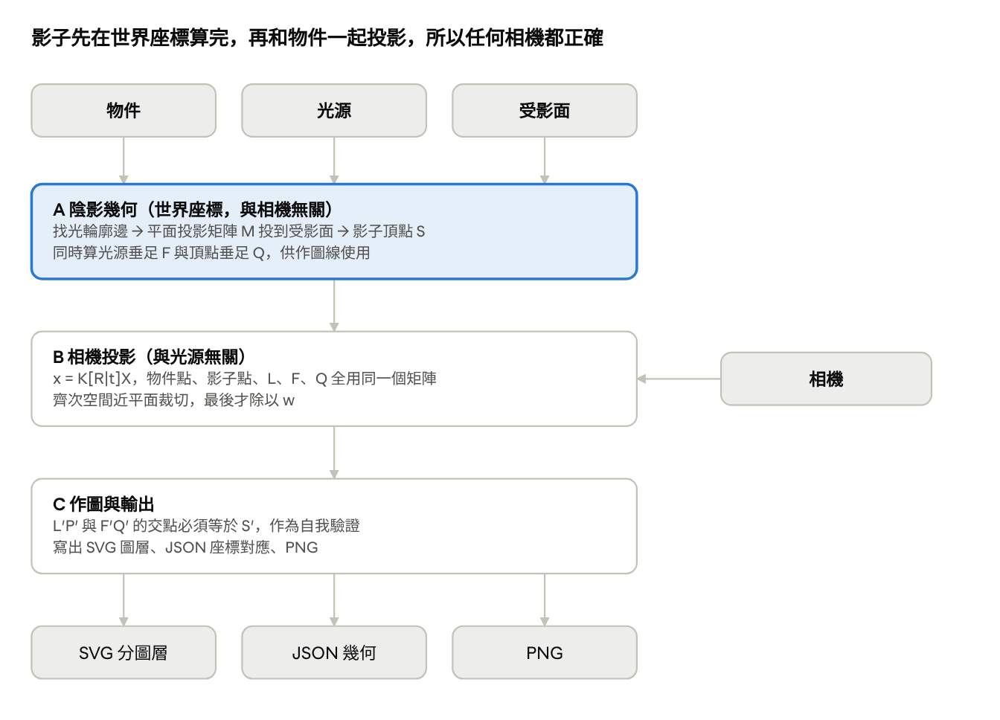
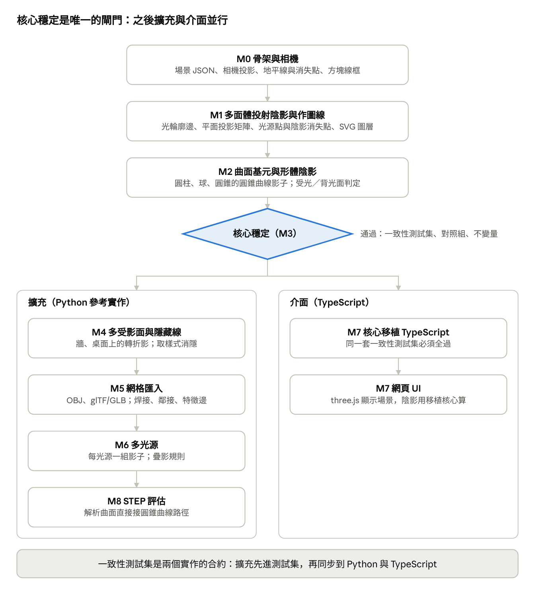

# 透視陰影作圖系統 — 規格文件與里程碑 v0.1

Oct 6, 2026 · @斜光流巡

## 1. 目的與範圍

使用者在 3D 中擺好物件、光源與受影面，之後任選相機位置、角度與焦距，系統輸出數學正確的透視線稿、投射陰影，以及畫家能照著畫的作圖線（光源點、陰影消失點、輔助線）。作圖線是必要輸出，不是附加功能。

用途：自用，畫漫畫與插畫背景時的透視與陰影底稿。輸出要能疊進繪圖軟體描繪，也要讓人看懂陰影為何落在那裡。

v1 範圍：

- 參數化基元：方塊、圓柱、球、圓錐、稜柱（任意多邊形底面）
- 單一光源：點光或平行光；資料結構為陣列，預留多光源
- 單一受影面：無界地面 z = 0
- 直線透視相機：位置、朝向（含俯仰，即三點透視）、焦距、主點偏移
- 投射陰影（影）與受光／背光判定（陰）
- 輸出 SVG 分圖層、JSON 幾何、PNG
- 純 Python 函式庫加命令列，無 GUI

v1 不做，列入後續版本：多受影面、隱藏線消除、網格匯入、多光源、曲線透視、軟陰影、互動 UI、STEP。

## 2. 名詞定義

全文以齊次座標表示點與平面：X = (x, y, z, w)，w = 0 為無窮遠點（方向或消失點）。

| 名詞 | 定義 | 符號 |
| --- | --- | --- |
| 受影面 | 承接影子的平面；v1 只有地面 | π = (n, d)，滿足 n·X + d = 0 |
| 光源 | 點光（有位置）或平行光（只有方向，指向光源） | L；點光 w = 1，平行光 w = 0 |
| 受光面 / 背光面 | 面法線與「指向光源的方向」內積為正 / 負的面 | lit(f) |
| 光輪廓邊 | 相鄰兩面一受光、一背光的邊；其頂點決定影子輪廓 | — |
| 影（投射陰影） | 物體擋住光線後落在受影面上的暗區 | 陰影點 S |
| 陰（形體陰影） | 物體自身的背光面；曲面上的分界線稱明暗交界線 | — |
| 頂點垂足 | 頂點沿受影面法線投到受影面的點 | Q |
| 光源垂足 | 光源沿受影面法線投到受影面的點；平行光時為無窮遠點 | F |
| 光源點 | 光源在畫面上的投影；光源在觀者後方時落在地平線下，稱反光點 | L′ |
| 陰影消失點 | 光源垂足在畫面上的投影；平行光時落在地平線上 | F′ |
| 作圖線 | 畫面上 L′P′ 與 F′Q′ 兩條線，交點即陰影點的投影 S′ | L′P′、F′Q′ |
| 地平線 | 與眼睛同高的水平面在畫面上的投影 | — |
| 消失點 | 一束平行線在畫面上的匯聚點（w = 0 的點的投影） | — |
| 主點 | 視線（光軸）與畫面的交點；主點偏移等同移軸 | (u₀, v₀) |
| 畫面座標 | 畫面上的 2D 座標，單位 mm，原點在主點 | (u, v) |

## 3. 系統架構



A 段只看物件、光源、受影面；相機只進入 B 段，所以換任何相機都不必重算影子。三段都是純函式，第 5 節的公式按此順序套用，UI 之後掛在 C 段之上。

## 4. 輸入規格：場景 JSON

一個場景檔描述物件、光源、受影面、相機與輸出設定；相機可獨立換檔，其餘不動。座標系為右手系、Z 向上、單位公尺、地面 z = 0；物件錨點在底面中心，放在地面上時 z = 0。

```json
{
  "version": "0.1",
  "units": "m",
  "up": "z",
  "objects": [
    {"id": "crate", "type": "box", "size": [1.0, 0.8, 0.6],
     "transform": {"position": [2.0, 4.0, 0.0], "rotation_deg": [0, 0, 30]}},
    {"id": "pillar", "type": "cylinder", "radius": 0.3, "height": 2.4,
     "transform": {"position": [-1.5, 6.0, 0.0]}}
  ],
  "lights": [
    {"id": "lamp", "type": "point", "position": [0.0, 3.0, 3.5]}
  ],
  "receivers": [
    {"id": "ground", "type": "plane", "normal": [0, 0, 1], "offset": 0.0}
  ],
  "camera": {
    "position": [0.0, 0.0, 1.5],
    "target": [0.0, 5.0, 1.0],
    "roll_deg": 0,
    "focal_length_mm": 35,
    "frame_mm": [36, 24],
    "shift_mm": [0.0, 0.0],
    "near_m": 0.05
  },
  "output": {
    "canvas_mm": [257, 182],
    "layers": ["horizon", "objects", "form_shadow", "cast_shadow", "construction", "labels"],
    "png_dpi": 300
  }
}
```

| 區塊 | 欄位 | 規格 |
| --- | --- | --- |
| objects[] | type | box（size）、cylinder（radius, height）、sphere（radius）、cone（radius, height）、prism（polygon 2D 頂點列 + height）；v2 加 mesh（path） |
| objects[] | transform | position 為錨點世界座標；rotation_deg 為 Z-Y-X 順序的歐拉角；scale 不提供，用 size 參數 |
| lights[] | type | point（position）或 directional（direction，指向光源）；v1 長度必須為 1，否則回報錯誤；id 用於輸出分組 |
| receivers[] | type | plane（normal, offset），n·X + offset = 0；v1 長度必須為 1 且無界；v2 加 bounds（多邊形） |
| camera | 姿態 | position + target + roll_deg（預設）或 position + yaw/pitch/roll_deg，二擇一 |
| camera | 鏡頭 | focal_length_mm 與 frame_mm 決定視角；shift_mm 為主點偏移（移軸）；near_m 為近平面裁切距離 |
| output | canvas_mm | 畫面輸出尺寸，長寬比必須等於 frame_mm，否則回報錯誤 |
| output | layers | 要輸出的圖層子集，名稱見第 6 節 |

焦距與觀者距離是兩個參數：position 改變透視強弱與地平線高度，focal_length_mm 只改變放大倍率與視野。

## 5. 數學模型（規範性）

模型是射影幾何：點光與平行光、有限點與消失點共用同一套 4×4 公式，影子先在世界座標算完，再與物件頂點用同一個相機矩陣投影。以下為實作必須遵守的定義。

### 5.1 受影面與光源

受影面 π = (n, d)，光源 L = (l, w)。點光 w = 1，l 為位置；平行光 w = 0，l 為指向光源的單位方向。面 f 受光的判定對兩種光源同式：

```latex
\mathrm{lit}(f) \iff n_f \cdot (l - w\,p) > 0,\quad p \in f
```

光輪廓邊：相鄰兩面 lit 值不同的邊。只有光輪廓邊的頂點需要投影，其連線即影子邊界。

### 5.2 平面投影矩陣

```latex
M = (\pi^{\mathsf T} L)\, I_4 - L\, \pi^{\mathsf T}, \qquad S = M\,P
```

S 的 w 分量為 0 或負值時，該頂點的影子落在無窮遠或受影面另一側（頂點不低於點光源、平行光水平），見 5.6。

### 5.3 垂足

頂點 P 與光源 L 沿受影面法線的垂足，以齊次形式統一寫法，平行光的 F 自動成為無窮遠點：

```latex
Q = (n\cdot n)\,P - (n\cdot p + w_P\,d)\,(n, 0), \qquad F = (n\cdot n)\,L - (n\cdot l + w\,d)\,(n, 0)
```

### 5.4 相機投影

```latex
\tilde{x} = K\,[R \mid t]\,X,\qquad K = \begin{pmatrix} f & 0 & u_0 \\ 0 & f & v_0 \\ 0 & 0 & 1 \end{pmatrix},\qquad (u, v) = \left(\tilde{x}_1/\tilde{x}_3,\ \tilde{x}_2/\tilde{x}_3\right)
```

f 為焦距（mm），(u₀, v₀) 為主點偏移（mm），畫面座標為 mm。順序固定：投影成齊次 3 維向量，在齊次空間對近平面裁切線段（深度 x̃₃ ≥ near），最後才除以 w。物件頂點、影子頂點、L、F、Q 全部套同一個矩陣。

### 5.5 作圖點與作圖線

畫面上的光源點 L′、陰影消失點 F′、頂點投影 P′ 與其垂足投影 Q′，皆為上式輸出。作圖線為 L′P′ 與 F′Q′，其交點必須等於直接計算的影子點投影，這是系統的自我驗證條件：

```latex
S' \sim (L' \times P') \times (F' \times Q') \sim K[R \mid t]\,M\,P
```

地平線為受影面無窮遠線的投影；各方向的消失點為 (d, 0) 的投影。

### 5.6 曲面基元

曲面不取樣，影子邊界以圓錐曲線精確傳遞。平面上的圓以 3×3 矩陣 C 表示，E 為該平面到世界齊次座標的 4×3 嵌入，經受影面投影與相機投影後仍為圓錐曲線：

```latex
H = K[R \mid t]\,M\,E, \qquad C' = H^{-\mathsf T}\, C\, H^{-1}
```

- 球：光輪廓是一個圓，圓心在 c + (r²/|l − c|²)(l − c)，半徑 r·√(1 − r²/|l − c|²)，法線沿 l − c；平行光時為法線沿 l 的大圓。影子為該圓的投影。
- 圓柱：光輪廓為兩條母線加端面圓弧。母線位置：光源在底面的投影點對底圓作切線，兩切點所在的母線；點光源時此條件沿整條母線成立。
- 圓錐：光輪廓為兩條母線加底圓弧，母線由頂點對底圓的切線條件決定。
- 輸出：橢圓直接寫 SVG ellipse；拋物線、雙曲線以參數取樣成折線（僅輸出階段取樣，計算不取樣）。

### 5.7 退化情況

| 情況 | 數學徵兆 | 處理 |
| --- | --- | --- |
| 光源在觀者後方 | L 的相機深度 x̃₃ < 0 | L′ 仍為有限點（反光點，落在地平線下）；作圖線經近平面裁切後繪製 |
| 光源方向與畫面平行 | L′ 的 w = 0 | L′ 為畫面上的方向，作圖線畫成平行線 |
| 平行光水平 | n·l = 0 | 影子無限長；回報警告，不輸出影子 |
| 頂點不低於點光源 | (M·P) 的 w ≤ 0 | 該頂點無落地影子；影子多邊形成為無界區域，裁切到畫面範圍後輸出並標記 |
| 頂點或影子點在相機後方 | x̃₃ < near | 齊次近平面裁切，線段分割 |
| 面與光線平行 | n·(l − w p) = 0 | 視為背光，容差內取等號為負 |

### 5.8 數值規範

- 全程 float64；容差 ε = 1e-9 乘以場景包圍盒尺度。
- 齊次向量以最大分量正規化，避免溢位；不在裁切前除以 w。
- 所有判定（受光、輪廓、裁切）以內積符號加容差決定，不用等號。
- 退化情況回傳結構化警告（代碼 + 相關 id），不拋例外，輸出仍完整。

## 6. 輸出規格

同一次計算輸出三種形式：SVG 給人看與疊圖、JSON 給程式與測試、PNG 給繪圖軟體。三者的畫面座標完全相同：單位 mm，原點在主點，u 向右、v 向上；寫入 SVG 時翻轉 v 並平移到左上原點，viewBox 等於 canvas_mm。

### 6.1 SVG 圖層

每個圖層是一個帶 id 的 g 元素，可在繪圖軟體中個別開關。v1 不消隱，所有邊都畫，背面邊以虛線區分。

| 圖層 id | 內容 | 預設樣式 |
| --- | --- | --- |
| horizon | 地平線、各方向消失點、主點 | 細灰線、小圓點加名稱 |
| objects | 物件所有邊；曲面基元為輪廓線與端面圓錐曲線 | 實線；背面邊虛線 |
| form_shadow | 背光面，曲面則為明暗交界線 | 半透明填色、交界線細線 |
| cast_shadow | 影子輪廓（多邊形或圓錐曲線）；以光源 id 分子圖層 | 半透明填色加輪廓線 |
| construction | 光源點 L′、陰影消失點 F′、頂點垂線 PQ、作圖線 L′P′ 與 F′Q′ | 細彩色線，L′ 與 F′ 加標記 |
| labels | 頂點編號、點名稱、物件 id | 小字 |

### 6.2 JSON 幾何

記錄每個 2D 點的來源 3D 點與所屬物件，讓畫面上任一點都能追溯；也是一致性測試集的比對格式。

```json
{
  "canvas_mm": [257, 182],
  "camera": {"P": [[...], [...], [...]]},
  "points": {
    "crate.v0": {"world": [2.4, 3.6, 0.6], "image": [12.31, -40.08], "depth": 3.92},
    "crate.v0.shadow.lamp": {"world": [3.1, 3.8, 0.0], "image": [15.02, -47.9], "depth": 4.1}
  },
  "edges": [{"object": "crate", "from": "crate.v0", "to": "crate.v1", "silhouette": true, "back": false}],
  "shadows": [{"light": "lamp", "receiver": "ground", "object": "crate",
               "outline": ["crate.v1.shadow.lamp", "crate.v2.shadow.lamp"], "conics": [], "unbounded": false}],
  "construction": {"light_point": [-80.5, 60.2], "shadow_vp": [-80.5, -12.0], "rays": [["L", "crate.v0"], ["F", "crate.v0.foot"]]},
  "horizon": {"v_mm": -12.0, "vanishing_points": {"x": [310.2, -12.0], "y": [-95.7, -12.0]}},
  "warnings": []
}
```

### 6.3 PNG

由 SVG 柵格化（cairosvg 或 resvg），解析度依 png_dpi，背景透明，圖層合併順序同 6.1 由上到下。

## 7. 驗證與測試

正確性靠四層測試，從數學不變量到獨立對照組，最後固定成一致性測試集，作為 TypeScript 移植的合約。

### 7.1 不變量（每次提交必跑）

| 不變量 | 檢查內容 | 容差 |
| --- | --- | --- |
| 作圖法等於直接計算 | 每個影子頂點：L′P′ 與 F′Q′ 的交點 = 直接投影的 S′ | 1e-6 mm |
| 影子與相機無關 | 任兩個相機下，世界座標的影子頂點相同 | 1e-9 m |
| 點光趨近平行光 | 點光沿方向 l 退到 10⁶ m 外，影子收斂到平行光結果 | 1e-4 m |
| 剛體等變 | 場景、光源、相機一起旋轉平移，畫面輸出不變 | 1e-6 mm |
| 齊次尺度不變 | 任何齊次向量乘以非零常數，結果不變 | 1e-9 |
| 無 NaN、無 Inf | 任何輸入下輸出皆為有限數，退化情況只產生警告 | — |

### 7.2 解析案例（手算答案）

- 單位方塊在原點，點光在 (0, 0, h)：影子頂點為底面頂點放大 h/(h − 1) 倍。
- 太陽仰角 45°：影長等於物高；仰角 30°：影長為物高的 √3 倍。
- 球心 (0, 0, r)、平行光斜照：影子橢圓的長短軸有閉式解，與圓錐曲線輸出比對。
- 相機平視（pitch = 0）：垂直邊投影後保持垂直；pitch ≠ 0：垂直邊匯聚到第三消失點。

### 7.3 光線投射對照組

亂數生成場景（基元 1–10 個、光源與相機隨機），在受影面取樣網格，每個樣本點朝光源射線測試是否被任何物體擋住，得到影子遮罩；幾何法的影子多邊形柵格化後與遮罩比對，IoU 必須 ≥ 0.99（差異受取樣解析度限制）。此法與幾何法共用零程式碼，是獨立的正確性來源。

### 7.4 屬性測試

以 hypothesis 生成隨機場景與相機，驗證 7.1 全部不變量，並針對退化情況（光源在背後、與畫面平行、頂點高於光源）生成專門分佈，確認只回報警告、不崩潰。

### 7.5 一致性測試集

- 位置：tests/conformance/cases/*.json（輸入）與 expected/*.json（第 6.2 節格式的輸出）。
- 比對：所有 image 座標容差 1e-6 mm，warnings 代碼集合必須相同。
- 來源：7.2 的解析案例、7.3 通過的亂數場景各取樣若干、每個退化情況至少一例。
- 規則：擴充功能先加測試案例，再改實作；TypeScript 移植必須全數通過；測試集版本化，變更需記錄原因。

## 8. 非功能需求

核心是純函式庫：沒有狀態、沒有 GUI 依賴、相同輸入永遠得到相同輸出。效能數字為目標值，以 M3 的基準場景量測。

| 需求 | 規格 |
| --- | --- |
| 精度 | float64；畫面座標相對解析解誤差 < 1e-6 mm |
| 效能 | 100 個基元、1 萬條邊、單光源單受影面，含 SVG 輸出 < 1 s；只換相機重算 < 100 ms（為互動預留） |
| 確定性 | 相同輸入產生位元相同的 JSON；無隨機、無時間相依、無浮點累加順序差異 |
| 相依 | 核心只依賴 numpy；載入（trimesh）、輸出（svgwrite、cairosvg）為可選附加套件 |
| 可移植 | 核心 API 為純函式，輸入輸出皆為可 JSON 序列化的資料；不使用 Python 特有的物件模型，便於移植到 TypeScript |
| 錯誤處理 | 輸入格式錯誤拋例外並指出欄位；幾何退化只回傳警告，輸出仍完整 |
| 可讀性 | 公式與程式碼一一對應，函式名稱沿用第 5 節符號（lit、silhouette_edges、shadow_matrix、foot、project） |

## 9. 擴充預留與設計約束

v1 的資料結構與 API 現在就按後續版本的形狀設計，之後只加功能、不改介面。

| 擴充項 | v1 必須預留的設計 | 版本 |
| --- | --- | --- |
| 多光源 | lights 為陣列；每個影子結果帶 light id；API 接受光源列表，v1 只驗證長度為 1；SVG 的 cast_shadow 以光源分子圖層。多光源的疊影規則（本影為各影子交集、半影區分）在 M6 定義 | M6 |
| 多受影面 | receivers 為陣列，每面可帶 bounds 多邊形；每面各有自己的 F 與 F′；影子多邊形逐面計算再裁切；交線處自然轉折 | M4 |
| 隱藏線消除 | 每條邊與影子輪廓預留 visibility 欄位（可見、隱藏、分段）；v1 全部標可見；M4 以取樣法填入 | M4 |
| 網格匯入 | 基元與網格共用內部表示：頂點、邊、面與面鄰接；基元內部也產生此表示，曲面基元額外帶解析參數。前處理管線：焊接頂點 → 建邊與鄰接 → 合併共面三角形 → 以二面角分特徵邊與平滑邊 → 流形檢查；非流形退路為逐面投影取聯集 | M5 |
| 匯入格式 | OBJ（多邊形、平滑群組）、glTF/GLB（階層、公尺、相機、KHR_lights_punctual 光源、extras 基元參數）；STL、PLY 經 trimesh 轉內部表示；FBX、DAE 外部轉 glTF | M5 |
| STEP | 解析曲面（圓柱面、球面、圓錐面）直接接 5.6 的圓錐曲線路徑；候選解析器 pythonOCC；下一版評估 | M8 |
| TypeScript 移植 | 觸發條件為通過 M3 閘門；移植範圍為核心（幾何、投影、作圖），不含載入器與柵格化；兩個實作共用 7.5 一致性測試集，Python 為參考實作；網頁 UI 用 three.js 顯示場景，但陰影一律用移植核心計算，不用 three.js 的 shadow map | M7 |
| 曲線透視 | 相機投影獨立成一個函式介面，之後可替換為魚眼或四、五點透視的映射；作圖線在曲線透視下不保證為直線 | 未排程 |

## 10. 里程碑



M0–M2 序列完成，M3 是唯一閘門：通過後擴充與 TypeScript 移植並行，每個擴充先寫進一致性測試集，再在兩個實作裡完成。未排日期；每個里程碑以驗收標準定義完成。

| 里程碑 | 交付物 | 驗收標準 | 相依 |
| --- | --- | --- | --- |
| M0 骨架與相機 | 場景 JSON 讀取與驗證、相機矩陣、近平面裁切、方塊線框 SVG、地平線與消失點 | 7.2 的相機案例通過；任意相機參數不報錯 | — |
| M1 多面體投射陰影與作圖線 | 平面投影矩陣、受光判定、光輪廓邊、影子多邊形、L′ F′ 與作圖線、六個 SVG 圖層、JSON 輸出 | 7.1 不變量全過；5.7 退化情況各有測試；方塊與稜柱手算案例通過 | M0 |
| M2 曲面基元與形體陰影 | 圓柱、球、圓錐的圓錐曲線影子、明暗交界線、SVG ellipse 輸出 | 球影子長短軸閉式解比對；圓柱切線母線位置手算比對 | M1 |
| M3 核心穩定（閘門） | 光線投射對照組、屬性測試、一致性測試集 v1、效能基準 | IoU ≥ 0.99；屬性測試無失敗；第 8 節效能目標達標 | M2 |
| M4 多受影面與隱藏線 | 有界受影面、逐面裁切、轉折影、取樣式隱藏線、visibility 欄位 | 牆加地面案例轉折位置手算比對；消隱結果與對照組深度一致 | M3 |
| M5 網格匯入 | OBJ、glTF/GLB 載入、前處理管線、extras 基元參數 | 匯入的方塊與參數化方塊輸出相同；非流形網格走退路並回報警告 | M3 |
| M6 多光源 | 多光源影子分組、疊影規則、SVG 子圖層 | 兩光源案例：各自影子等於單光源結果；本影為交集 | M4 |
| M7 TypeScript 移植與網頁 UI | 核心移植、three.js 場景顯示、相機拖曳、SVG 下載 | 一致性測試集 100% 通過；相機拖曳即時更新 | M3 |
| M8 STEP 評估 | 可行性報告、原型解析器 | 一個 STEP 圓柱匯入後影子與參數化圓柱一致 | M5 |

## 11. 決策紀錄與風險

### 11.1 已定案

| 決策 | 內容 | 理由 |
| --- | --- | --- |
| 輸出 | 作圖線為必要輸出 | 上一輪搜尋結論：引擎能算影子，缺的是畫家可照著畫的作圖線 |
| 數學模型 | 射影幾何、光輪廓邊投影、曲面用圓錐曲線 | 精確、closed-form、作圖線為中間產物；shadow map 與光追反推不出作圖線 |
| 語言 | Python 核心函式庫 + SVG/JSON 輸出；核心穩定後移植 TypeScript 做網頁 UI | 第一版不需 UI，正確性是難點；Python 的測試與網格工具最省力，且為現有工具鏈 |
| 物件 | v1 參數化基元，v2 匯入網格 | 作圖線需要可列舉的頂點與解析資訊 |
| 匯入格式 | 自訂場景 JSON；匯入 OBJ 與 glTF/GLB；FBX、DAE 外部轉檔；STEP 下一版評估 | 標準網格格式無法表達參數化基元；glTF 能帶階層、單位、相機與光源 |
| 光源 | v1 單一光源，結構預留多光源 | 先把單光源的作圖線做對 |
| 受影面 | v1 只有無界地面 | 多平面與轉折影留 M4 |
| 隱藏線 | v1 不消隱，全線框分圖層；M4 以取樣法消隱 | 精確向量 HLR 是最難的一段，畫圖用途取樣即可 |
| 相機 | 直線透視含三點透視；曲線透視不做 | 作圖線在直線透視下才是直線 |

### 11.2 本文件假設

- 座標系：右手系、Z 向上、公尺、地面 z = 0，物件錨點在底面中心。
- 相機預設以 position + target + roll 描述，另提供 yaw/pitch/roll 形式。
- 畫面座標單位 mm、原點在主點；canvas_mm 長寬比須等於 frame_mm。
- TypeScript 移植在 M3 閘門後與擴充並行，而非等 M4–M6 完成。

### 11.3 風險

| 風險 | 影響 | 對策 |
| --- | --- | --- |
| 隱藏線消除比預期難 | M4 延後 | 取樣法先行；精確 HLR 不列入承諾 |
| 匯入網格非流形或無拓撲 | 找不到光輪廓邊 | 前處理焊接與檢查；退路為逐面投影取聯集 |
| 退化情況處理不完整 | 特定光源或相機位置輸出錯誤或崩潰 | 5.7 逐項建測試案例；屬性測試專門生成退化分佈 |
| 無界影子區域的裁切與繪製 | 畫面邊緣出現錯誤填色 | 以畫面外擴矩形裁切，JSON 標記 unbounded |
| 圓錐曲線在近乎退化時數值不穩 | 橢圓變形 | 以最大分量正規化；接近退化改為取樣折線並回報警告 |
| 兩個實作漂移 | TypeScript 與 Python 結果不同 | 一致性測試集為合約；擴充先進測試集 |
