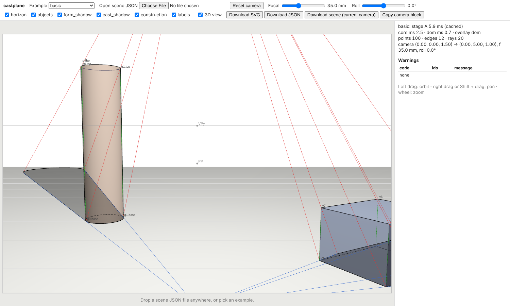
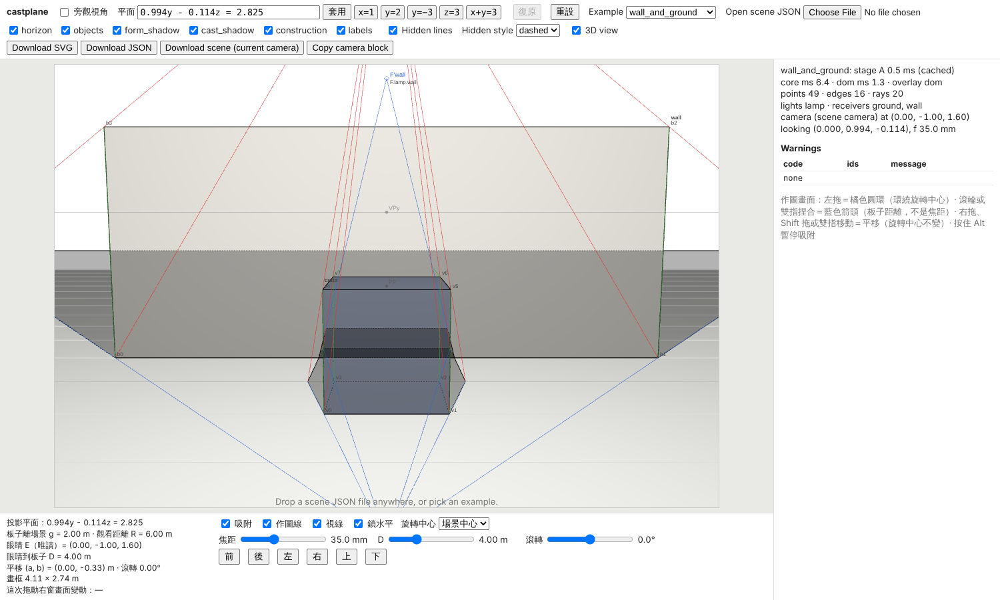
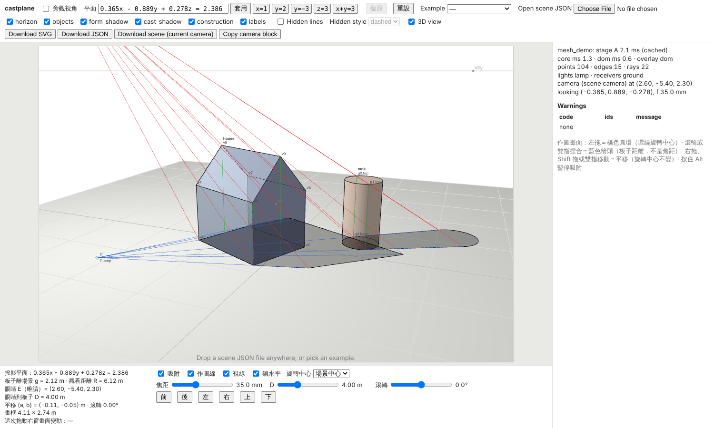
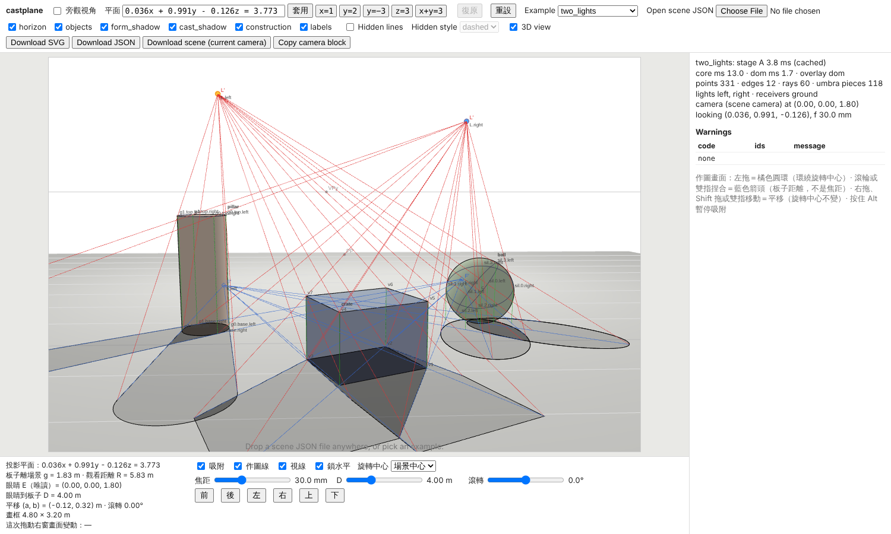

# castplane web UI

The three.js web UI of the castplane TypeScript port (contract `docs/ARCHITECTURE.md` §5.4.10). Load a scene JSON,
look at it in 3D, drag the camera, and see the perspective shadow construction drawing that the ported core
(`ts/`) writes for that camera, laid exactly over the 3D view. It is static (no server, no network access at
runtime). The examples are bundled at build time.

```sh
npm ci                     # at the repository root (npm workspace: ts, web)
npm run -w ts build        # the core package "castplane" the UI imports
npm run -w web dev         # vite dev server
npm run -w web build       # tsc type check + vite build -> web/dist (static, base './')
npm run -w web preview     # serve web/dist locally
npm run -w web test        # orbit / download unit tests (node:test, web/test/)
```



Phase 2 (contract §5.4.10, the M4–M6 format): `wall_and_ground` with hidden lines on, the expanded `mesh_demo`, and
`two_lights`:





## What it does

- **Loading**: the *Example* menu (every `examples/*.json`, eight files, embedded by `import.meta.glob`), the file picker,
  or a file dropped anywhere on the page. A dropped file that is not JSON shows "not a JSON file". A scene
  that fails validation shows the `SceneError` field path and message in the error panel, and the previous
  scene stays loaded. The core reads expanded scenes only (contract §5.4.0): a `mesh` object must carry its
  geometry inline (`data`), so the bundled `mesh_demo` example, which names `meshes/house.obj`, shows the
  "mesh file must be expanded first" error; load an expanded scene instead (`castplane.io.expand_scene` of the
  example, or `castplane import FILE -o scene.json --inline` for a new scene).
- **3D view** (`src/scene3d.ts`, `src/mesh3d.ts`, `src/threeCamera.ts`): boxes, cylinders, cones, spheres, prisms
  and inline meshes (a `BufferGeometry` of the core's preprocessed triangles, taken from stage A so a mesh is not
  preprocessed twice, both sides drawn) placed with
  the core's `transform_frame`; light helpers, **one per light** in its own colour (a sphere for a point light, an
  arrow for a directional light; `src/helpers3d.ts`), whose three.js shading lights share one total intensity so a
  scene with several lights is not drawn brighter; and the receivers: the unbounded ground as a large plane with a
  grid, and each **bounded receiver as a plate** over its `bounds` (a triangle fan of the validated convex polygon,
  world coordinates) with an outline. The three.js camera is built from the core's `camera_matrix` (no `lookAt` and no
  `fov`), so the WebGL image and the SVG overlay are two renderings of one castplane camera. Three.js casts no
  shadows (`renderer.shadowMap.enabled = false`). Every shadow you see comes from the core.
- **Modules**: `src/main.ts` keeps the state, loading, the wiring and the render loop. `src/stage.ts` is one
  three.js view (`Stage3D`, plus `letterbox` for the canvas size), `src/input.ts` turns pointer, wheel and file-drop
  events into callbacks (`attach_drag_input`, `attach_file_drop`), and `src/ui.ts` drives the side panel (controls,
  layer boxes, examples menu, slider text, error panel, warnings table, status line, `save` for downloads).
- **Camera** (`src/orbit.ts`):
  - left drag orbits (yaw / pitch, with pitch clamped to ±89.5°; "grab the world" like OrbitControls, so dragging down lifts the camera);
  - right drag or Shift + drag pans;
  - the wheel zooms (distance 0.05 … 1e4 m);
  - sliders set the focal length (logarithmic, 8–400 mm) and the roll (±180°);
  - *Reset camera* restores the scene's camera.
  
  Every frame builds an explicit target-form camera block from the lens fields of the scene camera.
- **Overlay** (`src/overlay.ts`): an `<svg>` over the canvas with the same CSS box and `viewBox`. On each
  animation frame where something changed, the frame runs `project_scene` → `compose` → `write_svg` (all six
  layers) against the cached stage A. Pointer events only update the state and at most one core render runs per
  frame (the latest camera wins). The layer checkboxes hide groups with CSS (`hide-<layer>` classes). The
  *3D view* checkbox hides the WebGL canvas. The *Hidden lines* checkbox (contract §5.4.10, phase 2) is
  initialised from `output.hidden_lines` and passed as `hidden_lines` to `compose`; the *Hidden style* select
  (`dashed` / `omit`, §5.1.8; disabled while the checkbox is off) is initialised from `output.hidden_style` and passed
  to `write_svg`. During a drag the frames are composed with hidden lines off and, with two or more lights,
  `project_scene(..., umbra = false)` (§5.4.11 allows both: each switch-off document is a contract document); the
  resting frame recomputes them. Stage A is computed once per loaded scene and cached; every frame is the
  camera-only path `project_scene` → `compose` → `write_svg`.
- **Downloads** (`src/download.ts`):
  - *Download SVG*: `write_svg` with the checked layers (and the selected hidden style), `<name>.svg`;
  - *Download JSON*: the spec §6.2 document, `<name>.json`;
  - *Download scene (current camera)*: the scene with the current camera block, the *Hidden lines* state as
    `output.hidden_lines` and the *Hidden style* as `output.hidden_style`, `<name>.scene.json`. Run
    `castplane render <name>.scene.json -o out` to reproduce the picture with the Python reference: the
    smoke check below found the SVG byte-identical;
  - *Copy camera block*: copies the current camera block to the clipboard.
- **Panels**: the status line shows stage A ms (cached), `core ms` (B + C + SVG), `dom ms` (the overlay
  update), the overlay mode, the point / edge / ray counts (rays of every light), the umbra piece count (two or more
  lights), and the light and receiver ids. The warnings table lists `code`, `ids` and
  `message` of the current document.

### Overlay modes during a drag

At rest the overlay is always the DOM (`innerHTML` of the writer's inner markup). During a drag, a scene whose
last resting SVG is longer than **250 000 characters** (`IMG_MODE_THRESHOLD`) is shown instead through
``. That image is the writer's unchanged SVG text for the checked layers. The blob URL is
revoked on the next frame, and the DOM overlay comes back on pointer-up (contract §5.4.11). The eight examples
(8–28 k characters) always use the DOM mode. `benchmark_100.json` (1.96 M characters, ≈ 30 k elements) uses
the `` mode during a drag.

## Measured `core ms` / `dom ms` (acceptance §5.4.13 (b))

The measurements come from `web/scripts/smoke.mjs`, a dev helper that runs Playwright + Chromium. They are
the drag frames of a 30-step mouse drag per scene. Each cell gives the minimum over the 30 frames, with the
median in brackets, for three runs. The setup was `vite build` + `vite preview` and headless Chromium
141.0.7390.37 (WebGL through SwiftShader) on the CI container. `performance.now()` in Chromium has 0.1 ms
resolution.

`core ms` is `project_scene + compose + write_svg` with stage A cached. `dom ms` is the synchronous overlay
update: `innerHTML` in DOM mode, or the blob and `img.src` in `` mode. It does not include the browser's
later style, layout and paint, or the image decode.

| scene | SVG chars (resting frame after the drag) | drag mode | core ms run 1 | run 2 | run 3 | dom ms run 1 | run 2 | run 3 |
| --- | --- | --- | --- | --- | --- | --- | --- | --- |
| basic | 8 156 | DOM | 0.9 (1.2) | 0.9 (1.3) | 0.9 (1.3) | 0.5 (0.8) | 0.5 (0.8) | 0.5 (0.8) |
| construction_demo | 9 840 | DOM | 0.5 (0.7) | 0.6 (0.8) | 0.6 (1.0) | 0.7 (0.9) | 0.6 (0.9) | 0.6 (0.9) |
| curved_demo | 10 765 | DOM | 1.2 (1.8) | 1.4 (1.9) | 1.4 (1.8) | 0.6 (0.8) | 0.7 (0.9) | 0.7 (0.9) |
| directional | 11 118 | DOM | 1.3 (1.6) | 1.0 (1.5) | 1.3 (1.6) | 0.7 (0.8) | 0.8 (1.1) | 0.7 (1.1) |
| three_point | 9 847 | DOM | 0.5 (0.8) | 0.6 (0.7) | 0.6 (0.7) | 0.5 (0.8) | 0.5 (0.9) | 0.5 (0.7) |
| benchmark_100 | 1 961 491 | `` | 57.0 (85.5) | 63.0 (85.6) | 59.2 (108.2) | 12.3 (15.5) | 11.5 (13.8) | 10.9 (14.8) |

The "SVG chars" column is the length of the resting frame after the 30-step drag (`smoke.mjs` records
`rest.at(-1).svg_bytes`), which is the length `IMG_MODE_THRESHOLD` is compared with. At the scene camera the
writer's text (`node ts/scripts/render.mjs`, byte-identical to the Python writer) is 8 039 (basic), 9 860
(construction_demo), 10 803 (curved_demo), 12 717 (directional), 9 792 (three_point) and 1 960 727
(benchmark_100) characters.

For `benchmark_100.json` the resting frames (DOM mode, after load and after pointer-up) took 151 / 100, 98 / 105
and 111 / 129 ms of `innerHTML` in the three runs, plus the browser's layout of ≈ 30 k elements. This is why
the `` mode exists. The in-browser `core ms` is close to the node benchmark's camera-only row (55–63 ms
minimum, `benchmarks/README.md`).

### Phase 2 (M7 step 11, part 5): the eight examples

Same script, setup and container (headless Chromium 141.0.7390.37, SwiftShader), three runs, after the M4–M6 port.
Drag frames are composed with hidden lines off and, for `two_lights`, without the umbra (§5.4.11). `mesh_demo` is
its Python expansion loaded through the file picker (the bundled example names an OBJ file, see *Loading*).

| scene | SVG chars (resting frame after the drag) | drag mode | core ms run 1 | run 2 | run 3 | dom ms run 1 | run 2 | run 3 |
| --- | --- | --- | --- | --- | --- | --- | --- | --- |
| basic | 8 145 | DOM | 1.1 (1.5) | 1.1 (1.9) | 1.0 (1.5) | 0.5 (0.8) | 0.6 (1.0) | 0.6 (0.9) |
| construction_demo | 9 779 | DOM | 0.6 (0.9) | 0.8 (1.1) | 0.7 (0.9) | 0.8 (1.0) | 0.7 (0.9) | 0.6 (1.0) |
| curved_demo | 10 726 | DOM | 1.4 (1.9) | 1.6 (2.2) | 1.6 (2.0) | 0.7 (0.9) | 0.7 (1.1) | 0.6 (0.8) |
| directional | 11 221 | DOM | 1.3 (2.0) | 1.3 (2.0) | 1.4 (2.0) | 0.7 (1.1) | 0.7 (1.0) | 0.7 (1.0) |
| mesh_demo | 8 733 | DOM | 1.0 (1.2) | 0.9 (1.2) | 0.8 (1.3) | 0.5 (0.8) | 0.5 (0.7) | 0.6 (0.8) |
| three_point | 9 757 | DOM | 0.6 (1.0) | 0.6 (0.9) | 0.7 (1.0) | 0.6 (0.9) | 0.5 (0.8) | 0.6 (0.9) |
| two_lights | 27 663 | DOM | 2.0 (2.8) | 2.0 (2.5) | 2.0 (2.8) | 0.9 (1.2) | 0.9 (1.1) | 0.9 (1.3) |
| wall_and_ground | 8 981 | DOM | 0.6 (0.9) | 0.6 (0.9) | 0.6 (0.8) | 0.4 (0.7) | 0.4 (0.6) | 0.5 (0.7) |
| benchmark_100 | 1 959 112 | `` | 78.1 (109.8) | 66.3 (119.8) | 75.8 (141.8) | 11.0 (16.6) | 12.1 (14.9) | 13.0 (16.6) |

At rest (hidden lines and umbra recomputed) the overlay update took 0.6–2.8 ms for the examples; the status line of
the screenshots shows the resting frame's `core ms`: `wall_and_ground` 3.4 ms with hidden lines on, `two_lights`
8.6 ms with 119 umbra pieces, `mesh_demo` 1.5 ms. `benchmark_100.json`'s in-browser camera-only frame is slower
than in phase 1 (66–78 ms against 57–63 ms minimum; the node benchmark, `benchmarks/README.md`, is the gated
number); its resting DOM frames took 100–169 ms of `innerHTML`.

## Smoke check

```sh
npm run -w web build
(cd web && npx vite preview --port 4173 --strictPort) &
node web/scripts/smoke.mjs http://localhost:4173/ out/ docs/images/web_ui.png benchmarks/scenes/benchmark_100.json --shots docs/images
```

Run it with `PLAYWRIGHT_BROWSERS_PATH` pointing at an installed Chromium (on the CI container
`/opt/pw-browsers`; the script never installs one).

The script needs a Playwright installed outside the repository; it is not a dependency. It checks that:

- the page loads the default example and renders the six overlay groups;
- for each example it writes the bundled core's scene-camera SVG and JSON to `out/`;
- a 30-step drag per scene runs, and it measures the table above;
- a page-wide drop loads a scene;
- the three downloads are saved;
- the error panel appears for a non-JSON file and for an invalid scene;
- phase 2: an example that fails to load (the path-only `mesh_demo`) is reported and loaded from its Python
  expansion instead; `wall_and_ground` loads with *Hidden lines* on and `dashed` (from the scene), its overlay has
  the `objects.hidden` sub-groups with the dashed stroke, `omit` empties them, switching off removes them, and the
  3D view has the ground plane with its grid and the wall as a plate with an outline; `mesh_demo` shows the house
  mesh and the tank; `two_lights` has one helper per light, the per-light construction blocks and umbra pieces at
  rest, none during a drag and again after it. With `--shots DIR` it saves `DIR/web_ui_<name>.png` for these three.

Last run (phase 2, part 5; exit 0, no failed check, no page error):

- the bundled core in Chromium wrote SVG byte-identical to the Python writer for all eight examples
  (`mesh_demo` from its expansion), and its JSON passes the conformance comparator;
- the downloaded `<name>.scene.json`, rendered with the Python CLI, gives the downloaded SVG byte for byte.
