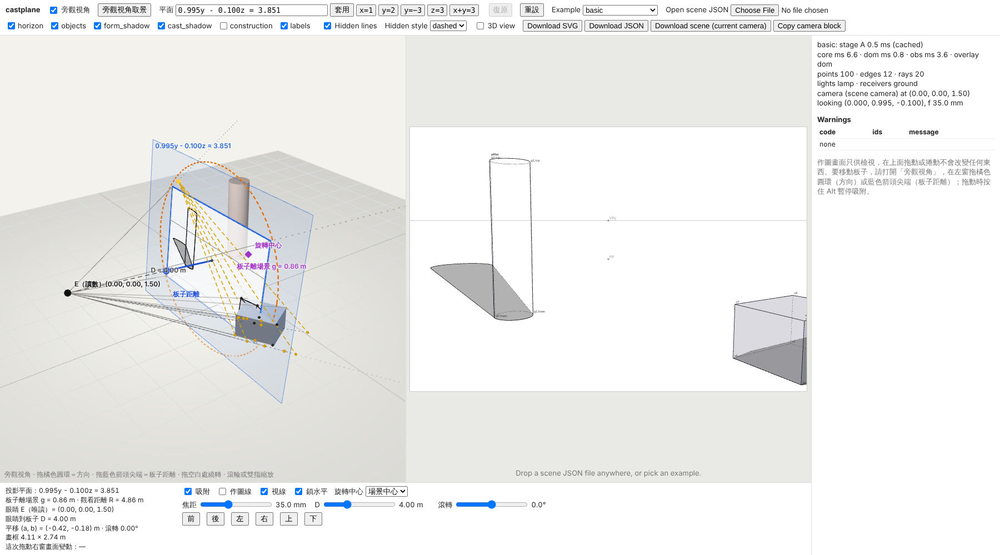
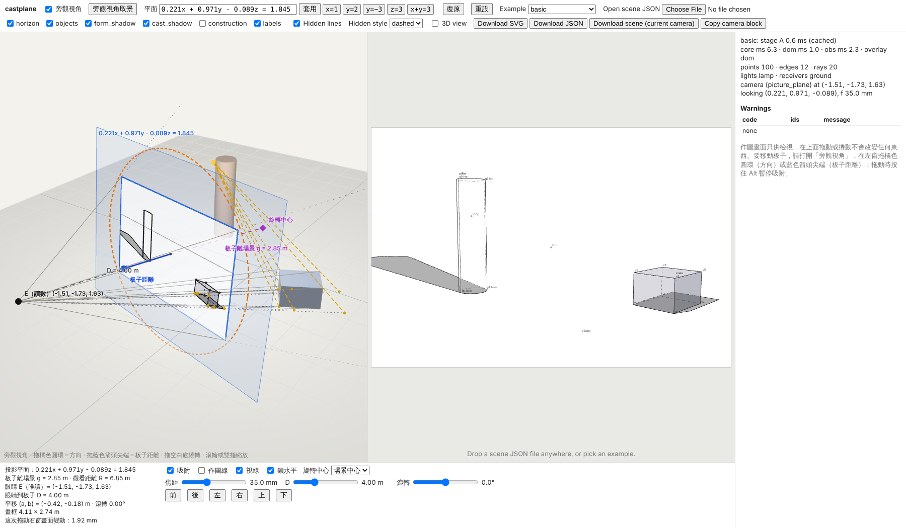

# castplane web UI

The three.js web UI of the castplane TypeScript port (contract `docs/ARCHITECTURE.md` §5.4.10). Load a scene JSON,
look at it in 3D, move the board that defines the camera, and see the perspective shadow construction drawing that the ported core
(`ts/`) writes for that camera, laid exactly over the 3D view. It is static (no server, no network access at
runtime). The examples are bundled at build time.

```sh
npm ci                     # at the repository root (npm workspace: ts, web)
npm run -w ts build        # the core package "castplane" the UI imports
npm run -w web dev         # vite dev server
npm run -w web build       # tsc type check + vite build -> web/dist (static, base './')
npm run -w web preview     # serve web/dist locally
npm run -w web test        # orbit / download / rig / equation / observer / plane unit tests (node:test, web/test/)
```


Phase 2 (contract §5.4.10, the M4–M6 format): `wall_and_ground` with hidden lines on, the expanded `mesh_demo`, and
`two_lights`:


M9 (contract §5.6): the observer view, switched on with *旁觀視角*:



M10 (contract §5.7): plane mode, the board moved with the orange ring and the blue arrow (here after `y=2` and a ring
drag):



## What it does

- **Loading**: the *Example* menu (every `examples/*.json`, eight files, embedded by `import.meta.glob`), the file picker,
  or a file dropped anywhere on the page. A dropped file that is not JSON shows "not a JSON file". A scene
  that fails validation shows the `SceneError` field path and message in the error panel, and the previous
  scene stays loaded. The core reads expanded scenes only (contract §5.4.0): a `mesh` object must carry its
  geometry inline (`data`), so the bundled `mesh_demo` example, which names `meshes/house.obj`, shows the
  "mesh file must be expanded first" error; load an expanded scene instead (`castplane.io.expand_scene` of the
  example, or `castplane import FILE -o scene.json --inline` for a new scene).
- **3D view** (`src/scene3d.ts`, `src/mesh3d.ts`, `src/threeCamera.ts`): boxes, cylinders, cones, spheres, prisms
  and inline meshes (a `BufferGeometry` of the core's preprocessed triangles, taken from stage A so a mesh is not
  preprocessed twice, both sides drawn) placed with
  the core's `transform_frame`; light helpers, **one per light** in its own colour (a sphere for a point light, an
  arrow for a directional light; `src/helpers3d.ts`), whose three.js shading lights share one total intensity so a
  scene with several lights is not drawn brighter; and the receivers: the unbounded ground as a large plane with a
  grid, and each **bounded receiver as a plate** over its `bounds` (a triangle fan of the validated convex polygon,
  world coordinates) with an outline. The three.js camera is built from the core's `camera_matrix` (no `lookAt` and no
  `fov`), so the WebGL image and the SVG overlay are two renderings of one castplane camera. Three.js casts no
  shadows (`renderer.shadowMap.enabled = false`). Every shadow you see comes from the core.
- **Modules**: `src/main.ts` keeps the page state, loading, the wiring and the render loop. `src/plane.ts` is plane
  mode's session (the rig of `src/rig.ts`, undo, pivot, readouts; pure, unit-tested). The drawing pane has no input
  handler (below). `src/stage.ts` is one three.js view (`Stage3D`, plus `letterbox` for the canvas size), `src/input.ts`
  handles the page-wide file drop, and `src/ui.ts` drives the controls and the side panel (layer boxes, examples menu,
  sliders, readouts, error panel, warnings table, status line, `save` for downloads). `src/orbit.ts` (the M7 camera)
  is kept with its tests; only its focal-slider mapping is still used.
- **Camera: plane mode** (M10, contract §5.7; `src/rig.ts`, `src/plane.ts`, `src/equation.ts`). You move the
  **board** (the picture plane), not the eye: its direction `f` and its distance `g` from the pivot. The eye `E` sits
  `D` behind the board and is computed (read-only): `E = P − (g + D)·f + L`, with `L` the pan. On load the scene's
  camera is turned into this state (pivot = scene centre, `D` = the `picture_plane` distance or 4 m). `R = g + D` is
  clamped into 0.8–40 m and `D` into 0.5–12 m, with a notice when a clamp changes the picture.
  - Drawing pane (right) is **read-only** (D79, spec-v0.2 §5.9): any drag on it (left, right or middle button,
    Shift, touch with one or two fingers, pen) and the wheel do nothing, quietly: no error, no hint, no undo step, no
    camera change, no grab cursor. It does not call `preventDefault` on wheel or touch events (the page scrolls
    natively; `touch-action` is the browser default on `#stage` and `none` only on `#observer`) and does not suppress
    the context menu. A file drop still works anywhere on the page. The former mappings (left drag = ring, wheel or
    pinch = arrow, right drag / Shift drag / two-finger move = pan) are removed.
  - Observer pane (left, with *旁觀視角*) is where the board is moved: drag the orange dashed ring to orbit (lock-horizontal by default, free roll
    with *鎖水平* off), and drag the blue arrow's tip (*板子距離*) to move the board along `f`. Hit radius: 14 px
    for a mouse, 26 px for touch, 0.8× for the ring; the tip wins. The black eye is never a handle. Anywhere else
    the drag orbits the observer camera; the wheel or a pinch zooms the observer camera. With the switch off no drag or
    wheel changes the camera: use the sliders, views, equation field, undo and 重設.
  - *吸附* (default on; Alt suspends it): within 5° of an axis the board snaps to it exactly, and an axis-parallel
    board's plane coordinate snaps to 0.1 m while the arrow is dragged.
  - Sliders: focal length (logarithmic, 8–400 mm), `D` (0.5–12 m, the board stays and the eye moves), roll (±180°
    about the line of sight; the eye stays). None of them is an undo step.
  - *旋轉中心*: 場景中心, or 點選物體 then click an object in the observer pane. The eye moves onto its axis (the pan
    is cleared). This is not an undo step. The pan `(a, b)` is no longer user-editable: it comes from the load rule
    (an eye off the pivot's axis) and is cleared by an object pick and by a view.
  - Views 前 後 左 右 上 下 (`f = +y, −y, +x, −x, −z, +z`; pan and roll cleared).
  - The plane-equation field always shows the current plane (`y = 2.00`, `0.707x + 0.707y = 1.200`). Type a linear
    equation in `x`, `y`, `z` and press Enter or 「套用」, or use the quick buttons `x=1`, `y=2`, `y=−3`, `z=3`,
    `x+y=3`. A bad equation turns the field red with the reason and keeps the plane.
  - 復原 (50 steps) and 重設 (the loaded state).
  - Readouts under the panes: the plane, `g` and `R`, `E`, `D`, pan and roll, the frame size in metres, and
    "這次拖動右窗畫面變動" (the largest image displacement of all object vertices since the start of the last drag, in
    frame mm; the drag is a ring or arrow drag in the observer pane). A notice appears when the eye is below the ground.

  Until the first change after a load or 重設, the core renders the scene's own camera, so the document and the
  downloads equal the CLI's. From then on it renders the rig's explicit `picture_plane` block (`position` plus
  `picture_plane {normal, offset[, up]}`; `up` only when not lock-horizontal or roll ≠ 0).
- **Overlay** (`src/overlay.ts`): an `<svg>` over the canvas with the same CSS box and `viewBox`. On each
  animation frame where something changed, the frame runs `project_scene` → `compose` → `write_svg` (all six
  layers) against the cached stage A. Pointer events only update the state and at most one core render runs per
  frame (the latest camera wins). The layer checkboxes hide groups with CSS (`hide-<layer>` classes). The
  *3D view* checkbox hides the WebGL canvas (hidden, it is not rendered). **The toolbar toggles are page-level UI state
  (D79, spec-v0.2 §2.1):** at page start `horizon`, `objects`, `form_shadow`, `cast_shadow`, `labels` and *Hidden
  lines* are checked, and `construction` (with its mirror 作圖線) and *3D view* are unchecked (the canvas is hidden
  from the first frame); a scene or example load keeps whatever you set and no longer reads `output.layers` or
  `output.hidden_lines`. The *Hidden lines* checkbox (contract §5.4.10, phase 2) is passed as `hidden_lines` to
  `compose`; the *Hidden style* select (`dashed` / `omit`, §5.1.8; enabled iff *Hidden lines* is checked) is
  initialised from `output.hidden_style` and passed to `write_svg`. During a drag the frames are composed with hidden lines off and, with two or more lights,
  `project_scene(..., umbra = false)` (§5.4.11 allows both: each switch-off document is a contract document); the
  resting frame recomputes them. Stage A is computed once per loaded scene and cached; every frame is the
  camera-only path `project_scene` → `compose` → `write_svg`.
- **Downloads** (`src/download.ts`):
  - *Download SVG*: `write_svg` with the checked layers (and the selected hidden style), `<name>.svg`;
  - *Download JSON*: the spec §6.2 document, `<name>.json`;
  - *Download scene (current camera)*: the scene with the current camera block (in plane mode the `picture_plane`
    form once the board was moved), the *Hidden lines* state as
    `output.hidden_lines` and the *Hidden style* as `output.hidden_style`, `<name>.scene.json`. Run
    `castplane render <name>.scene.json -o out` to reproduce the picture with the Python reference: the
    smoke check below found the SVG byte-identical;
  - *Copy camera block*: copies the current camera block to the clipboard.
- **Panels**: the status line shows stage A ms (cached), `core ms` (B + C + SVG), `dom ms` (the overlay
  update), the overlay mode, the point / edge / ray counts (rays of every light), the umbra piece count (two or more
  lights), and the light and receiver ids. The warnings table lists `code`, `ids` and
  `message` of the current document.

- **Observer view** (M9, contract §5.6; `src/observer.ts` pure and unit-tested, `src/observer3d.ts` the three.js
  pane). The toolbar switch *旁觀視角* (off by default, remembered per browser in `localStorage`) opens a second
  three.js view left of the drawing pane, at equal width; below 880 px of page width the two panes stack, the
  observer on top. With the switch off there is only the drawing pane: no second WebGL context is created and nothing is
  computed for it. The observer shows, from outside, the drawing camera's eye **E** (read-only, with its coordinates),
  the board (the picture plane at distance `D` in front of the eye: 4 m, or the `picture_plane` distance of the
  scene's camera clamped into 0.5–12 m), the frame on it (the canvas rectangle unprojected with the core's
  `unproject_to_plane`) with the current drawing laid on it 0.012 m towards the eye, the frustum (dotted on to 1.9×),
  the principal point `Q`, the `D` line, the pivot (the orbit target) with the `g` line (`g = R − D`), the plane's
  equation, and with *視線* (default on) the vertex rays of the first object: sight lines `E → P` with their crossings
  `P′` on the board, the light rays `L → S` of its vertices, the sight lines `E → S` and their crossings `S′`. The
  drawing on the frame follows the layer checkboxes; SVG arcs are drawn with 32 segments, ellipses with 72. Every
  drawing-camera change (handle drag, sliders, views, equation, example load, 重設) updates it in the same frame. In the
  observer pane a left drag on blank space orbits the observer camera (0.4°/px around, 0.3°/px up, elevation −5°…85°; the right and
  middle mouse buttons do nothing), the wheel or a two-finger pinch zooms (4–60 m); none of this touches the drawing.
  *旁觀視角取景* frames it (keeps the direction, targets the centroid of E, Q, the scene centre and its ground point,
  the point lights and the frame corners, distance `clamp(2.3 · radius, 6, 60)` m, pulled back further when a point
  would fall outside the pane's inner 90 %, as it would in the portrait side-by-side pane); it also frames after a
  scene load, 重設, 復原, a view, an applied equation and a pivot change, never during a drag. In M10 the pane also
  shows the plane-mode handles (the orange ring and the blue arrow, above). The observer draws the receivers see-through, so a frame below
  the ground stays visible. The status line shows `obs ms` (the observer's own cost per frame) while the switch is on.
  A scene's own camera (any form) is rendered as it is until the board is first moved (so the document, its warnings
  and the downloads are the CLI's); from then on the rig's `picture_plane` block, with the same picture.

### Overlay modes during a drag

At rest the overlay is always the DOM (`innerHTML` of the writer's inner markup). During a drag, a scene whose
last resting SVG is longer than **250 000 characters** (`IMG_MODE_THRESHOLD`) is shown instead through
``. That image is the writer's unchanged SVG text for the checked layers. The blob URL is
revoked on the next frame, and the DOM overlay comes back on pointer-up (contract §5.4.11). The eight examples
(8–28 k characters) always use the DOM mode. `benchmark_100.json` (1.96 M characters, ≈ 30 k elements) uses
the `` mode during a drag.

## Measured `core ms` / `dom ms` (acceptance §5.4.13 (b))

The measurements come from `web/scripts/smoke.mjs`, a dev helper that runs Playwright + Chromium. They are
the drag frames of a 30-step mouse drag per scene. Each cell gives the minimum over the 30 frames, with the
median in brackets, for three runs. The setup was `vite build` + `vite preview` and headless Chromium
141.0.7390.37 (WebGL through SwiftShader) on the CI container. `performance.now()` in Chromium has 0.1 ms
resolution.

`core ms` is `project_scene + compose + write_svg` with stage A cached. `dom ms` is the synchronous overlay
update: `innerHTML` in DOM mode, or the blob and `img.src` in `` mode. It does not include the browser's
later style, layout and paint, or the image decode.

| scene | SVG chars (resting frame after the drag) | drag mode | core ms run 1 | run 2 | run 3 | dom ms run 1 | run 2 | run 3 |
| --- | --- | --- | --- | --- | --- | --- | --- | --- |
| basic | 8 156 | DOM | 0.9 (1.2) | 0.9 (1.3) | 0.9 (1.3) | 0.5 (0.8) | 0.5 (0.8) | 0.5 (0.8) |
| construction_demo | 9 840 | DOM | 0.5 (0.7) | 0.6 (0.8) | 0.6 (1.0) | 0.7 (0.9) | 0.6 (0.9) | 0.6 (0.9) |
| curved_demo | 10 765 | DOM | 1.2 (1.8) | 1.4 (1.9) | 1.4 (1.8) | 0.6 (0.8) | 0.7 (0.9) | 0.7 (0.9) |
| directional | 11 118 | DOM | 1.3 (1.6) | 1.0 (1.5) | 1.3 (1.6) | 0.7 (0.8) | 0.8 (1.1) | 0.7 (1.1) |
| three_point | 9 847 | DOM | 0.5 (0.8) | 0.6 (0.7) | 0.6 (0.7) | 0.5 (0.8) | 0.5 (0.9) | 0.5 (0.7) |
| benchmark_100 | 1 961 491 | `` | 57.0 (85.5) | 63.0 (85.6) | 59.2 (108.2) | 12.3 (15.5) | 11.5 (13.8) | 10.9 (14.8) |

The "SVG chars" column is the length of the resting frame after the 30-step drag (`smoke.mjs` records
`rest.at(-1).svg_bytes`), which is the length `IMG_MODE_THRESHOLD` is compared with. At the scene camera the
writer's text (`node ts/scripts/render.mjs`, byte-identical to the Python writer) is 8 039 (basic), 9 860
(construction_demo), 10 803 (curved_demo), 12 717 (directional), 9 792 (three_point) and 1 960 727
(benchmark_100) characters.

For `benchmark_100.json` the resting frames (DOM mode, after load and after pointer-up) took 151 / 100, 98 / 105
and 111 / 129 ms of `innerHTML` in the three runs, plus the browser's layout of ≈ 30 k elements. This is why
the `` mode exists. The in-browser `core ms` is close to the node benchmark's camera-only row (55–63 ms
minimum, `benchmarks/README.md`).

### Phase 2 (M7 step 11, part 5): the eight examples

Same script, setup and container (headless Chromium 141.0.7390.37, SwiftShader), three runs, after the M4–M6 port.
Drag frames are composed with hidden lines off and, for `two_lights`, without the umbra (§5.4.11). `mesh_demo` is
its Python expansion loaded through the file picker (the bundled example names an OBJ file, see *Loading*).

| scene | SVG chars (resting frame after the drag) | drag mode | core ms run 1 | run 2 | run 3 | dom ms run 1 | run 2 | run 3 |
| --- | --- | --- | --- | --- | --- | --- | --- | --- |
| basic | 8 145 | DOM | 1.1 (1.5) | 1.1 (1.9) | 1.0 (1.5) | 0.5 (0.8) | 0.6 (1.0) | 0.6 (0.9) |
| construction_demo | 9 779 | DOM | 0.6 (0.9) | 0.8 (1.1) | 0.7 (0.9) | 0.8 (1.0) | 0.7 (0.9) | 0.6 (1.0) |
| curved_demo | 10 726 | DOM | 1.4 (1.9) | 1.6 (2.2) | 1.6 (2.0) | 0.7 (0.9) | 0.7 (1.1) | 0.6 (0.8) |
| directional | 11 221 | DOM | 1.3 (2.0) | 1.3 (2.0) | 1.4 (2.0) | 0.7 (1.1) | 0.7 (1.0) | 0.7 (1.0) |
| mesh_demo | 8 733 | DOM | 1.0 (1.2) | 0.9 (1.2) | 0.8 (1.3) | 0.5 (0.8) | 0.5 (0.7) | 0.6 (0.8) |
| three_point | 9 757 | DOM | 0.6 (1.0) | 0.6 (0.9) | 0.7 (1.0) | 0.6 (0.9) | 0.5 (0.8) | 0.6 (0.9) |
| two_lights | 27 663 | DOM | 2.0 (2.8) | 2.0 (2.5) | 2.0 (2.8) | 0.9 (1.2) | 0.9 (1.1) | 0.9 (1.3) |
| wall_and_ground | 8 981 | DOM | 0.6 (0.9) | 0.6 (0.9) | 0.6 (0.8) | 0.4 (0.7) | 0.4 (0.6) | 0.5 (0.7) |
| benchmark_100 | 1 959 112 | `` | 78.1 (109.8) | 66.3 (119.8) | 75.8 (141.8) | 11.0 (16.6) | 12.1 (14.9) | 13.0 (16.6) |

At rest (hidden lines and umbra recomputed) the overlay update took 0.6–2.8 ms for the examples; the status line of
the screenshots shows the resting frame's `core ms`: `wall_and_ground` 3.4 ms with hidden lines on, `two_lights`
8.6 ms with 119 umbra pieces, `mesh_demo` 1.5 ms. `benchmark_100.json`'s in-browser camera-only frame is slower
than in phase 1 (66–78 ms against 57–63 ms minimum; the node benchmark, `benchmarks/README.md`, is the gated
number); its resting DOM frames took 100–169 ms of `innerHTML`.

### M9: the observer view on

Same script and container (headless Chromium 141.0.7390.37, SwiftShader): a 30-step drag of the drawing camera per
scene with the observer switched on. `obs ms` is the observer's update (board, drawing on the frame, vertex rays and
the `renderer.render` call, which returns before the GPU work completes); `total` is `core ms + dom ms + obs ms` of
the frame. Minimum / median / maximum over the drag frames of one run:

| scene | obs ms | total |
| --- | --- | --- |
| basic | 2.3 / 4.6 / 10.3 | 4.1 / 6.7 / 14.3 |
| construction_demo | 2.3 / 3.5 / 7.6 | 4.1 / 5.5 / 9.9 |
| curved_demo | 2.1 / 2.8 / 8.3 | 4.3 / 5.3 / 11.1 |
| directional | 1.5 / 3.2 / 5.3 | 3.5 / 6.0 / 10.3 |
| three_point | 2.0 / 3.0 / 17.7 | 3.5 / 4.9 / 24.0 |
| benchmark_100 (recorded, not gated) | 54.3 / 158.8 / 238.1 | 166.8 / 286.2 / 486.2 |

The five examples stay far below the 100 ms frame of contract §5.6.9. `benchmark_100.json` draws ≈ 30 k segments on
the frame; with the observer off its drag frames are unchanged (table above).

## Smoke check

```sh
npm run -w web build
(cd web && npx vite preview --port 4173 --strictPort) &
node web/scripts/smoke.mjs http://localhost:4173/ out/ docs/images/web_ui.png benchmarks/scenes/benchmark_100.json --shots docs/images
```

Run it with `PLAYWRIGHT_BROWSERS_PATH` pointing at an installed Chromium (on the CI container
`/opt/pw-browsers`; the script never installs one).

The script needs a Playwright installed outside the repository; it is not a dependency. It checks that:

- the page loads the default example and renders the six overlay groups;
- for each example it writes the bundled core's scene-camera SVG and JSON to `out/`;
- a 30-step drag per scene runs, and it measures the table above;
- a page-wide drop loads a scene;
- the three downloads are saved;
- the error panel appears for a non-JSON file and for an invalid scene;
- phase 2: an example that fails to load (the path-only `mesh_demo`) is reported and loaded from its Python
  expansion instead; `wall_and_ground` renders with *Hidden lines* on (the default) and `dashed` (from the scene), its overlay has
  the `objects.hidden` sub-groups with the dashed stroke, `omit` empties them, switching off removes them, and the
  3D view has the ground plane with its grid and the wall as a plate with an outline; `mesh_demo` shows the house
  mesh and the tank; `two_lights` has one helper per light, the per-light construction blocks and umbra pieces at
  rest, none during a drag and again after it. With `--shots DIR` it saves `DIR/web_ui_<name>.png` for these three.
- M9 (contract §5.6.9): for the five phase-1 examples and the optional scene file the observer is switched on and
  off: the writer's SVG text, the overlay markup, the SVG / JSON download texts and the camera must be identical with
  the switch on and off; a 30-step drag of the drawing camera with the switch on records `obs ms` and checks
  `core + dom + obs < 100 ms` per frame on the five examples, and that the observer follows the drawing camera; an
  observer drag and wheel move only the observer; switching off hides the pane, its controls and `obs ms` and restores
  the drawing pane's size; a `picture_plane` scene camera loads with the board `y = 2.00`, `D = 4.00 m`; below 880 px
  the panes stack (observer on top), above they sit side by side at equal width; after the large scene's drag the
  `` overlay is not displayed at rest. Review fixes: after each load `E` and the frame corners are inside the
  observer pane; a right or middle drag leaves the observer still; the three v8 `picture_plane` cases render the scene
  camera's document (the expected file's warnings, `camera.picture_plane`) until a drag, the rig's `picture_plane`
  block after it (M10), and the scene's block again after 重設; a frame below the ground is drawn (its bottom edge's
  pixel colour). With `--shots DIR` it also saves `DIR/web_ui_observer.png`.
- M10 (contract §5.7.13, plane mode, on `basic` with the observer on):
  - the ring drag changes `f` and keeps `g`, `D`, `|E − P|`;
  - the arrow tip wins the hit test, and its drag changes `g` only (the eye moves along `f`);
  - the hit test never returns the eye, and a drag on it orbits the observer only;
  - any drag (buttons 0, 1, 2, Shift, touch) or wheel on the drawing pane leaves the rig, the observer, the undo
    stack and the readouts unchanged, and wheel / context-menu events are not default-prevented (D79);
  - the toolbar defaults hold at page start and survive a scene load (D79);
  - the roll slider keeps the eye, and `up` is written iff needed;
  - the D slider keeps the board;
  - the six views give exact axes;
  - `y=2` with `D = 4` puts the eye at `y = −2`;
  - `x==1` turns the field red and keeps the plane, and the quick button `x=1` applies;
  - undo and 重設 restore `f`, `g`, `up`, the focal length and the sliders;
  - an object click sets the pivot (label `旋轉中心：<id>`);
  - the drawing is identical with the observer on and off for an edited camera;
  - Download scene writes the `picture_plane` form and reloads to the same SVG;
  - 900 random rig states render finite numbers;
  - review fixes: a drag held across a scene load leaves
    the new scene alone; an object id with `:` is pickable; switching to object pivot mode without a pick keeps the
    pan; blurring a rejected equation clears its error; the D slider's thumb shows the clamped value after a drag;
    hovering the arrow tip shows the pointer cursor; the observer labels do not overlap.

  With `--shots DIR` it saves `DIR/web_ui_plane_mode.png`.

Last run (phase 2, part 5; exit 0, no failed check, no page error):

- the bundled core in Chromium wrote SVG byte-identical to the Python writer for all eight examples
  (`mesh_demo` from its expansion), and its JSON passes the conformance comparator;
- the downloaded `<name>.scene.json`, rendered with the Python CLI, gives the downloaded SVG byte for byte.

Last run (M9, with `benchmark_100.json` and `--shots`): exit 0, no failed check, no page error; every M9 check above
passed for the five examples and `benchmark_100.json`.

Last run (M10, with `benchmark_100.json` and `--shots`): exit 0, no failed check, no page error; every check above
passed. With the observer on, `core ms + dom ms + obs ms` per drag frame stayed below 25 ms on the five examples
(maximum over 30 frames); `benchmark_100.json` (recorded, not gated): `obs ms` 136–622 ms over two runs.
